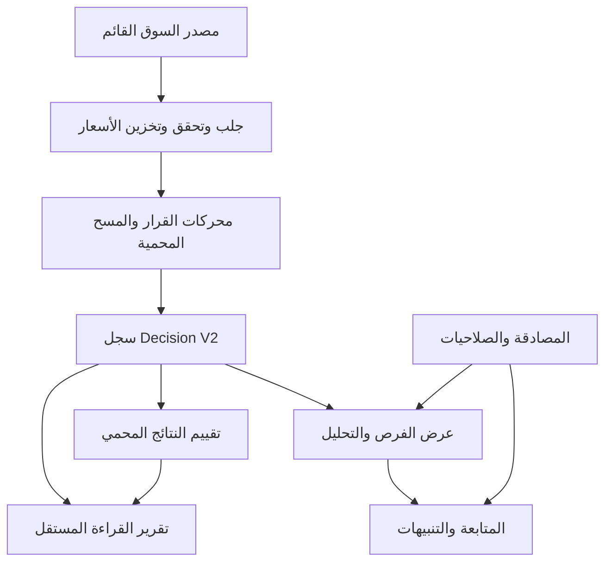

# تدقيق بصيرة — 9 سبتمبر 2026

هذه دفعة إصلاح واختبار معزولة، وليست شهادة جاهزية تجارية أو وعدًا بالربح. تعتمد النتائج على فحص المصدر واختبارات محلية وقراءة بيئة الاختبار، ولا تعمم صحة الاختبارات على دقة التوصيات.

## النسخة والنطاق

- المستودع: https://github.com/sayehm0a-afk/baseera-platform
- الفرع: `codex/basirah-audit-20260909`.
- المرجع المثبت: `88374a438829b90f34d8da58a37ccdc9f6c6a2a3`، نسخة PR114، في worktree مستقل.
- بقي مجلد المستخدم الأصلي وتغييره الموجود في `docs/agent_communication_flow.png` دون تعديل.
- لم يحدث نشر أو ترحيل قاعدة بيانات أو تغيير باقة أو مصدر بيانات أو قواعد قرار أو تردد مسح.
- طابقت بصمات 197 ملفًا في مجلدات التحليل والذكاء الاصطناعي وبيانات السوق ومحركات المسح والتقييم المرجع. هذا إثبات هوية مصدر، وليس إثبات تطابق التبعيات أو جودة القرارات.

## النتيجة التنفيذية

| البوابة | الحكم الفعلي |
|---|---|
| البيانات | غير مثبتة حيًا؛ بيئة الاختبار المعزولة بلا مزود سوق عامل وبلا مسح محفوظ. يلزم تحقق إنتاجي للقراءة أثناء جلسة فعلية، مع حقوق البيانات وتوقيتها وتغطيتها. |
| الوظائف والواجهات | إصلاحات محلية مختبرة وبناء ناجح؛ لا توجد رحلة متصفح كاملة للنسخة المعدلة بعد النشر التجريبي. |
| الحسابات والصلاحيات | تحسن مثبت في الاختبارات، منها إبطال الجلسة والتدوير وعزل الموارد؛ التحقق بخطوتين وPostgreSQL ورحلة البريد الحقيقي لم تُثبت. |
| جودة التوصيات | لا توجد عينة أداء حية مستقلة حصل عليها هذا التدقيق. لا نسبة نجاح معتمدة ولا دليل ربحية. |
| الإطلاق | غير معتمد. يلزم إغلاق العوائق عالية الأهمية ومراجعة مستقلة وموافقة صريحة للنشر. |

## ما أُصلح واختُبر

1. **إبطال جلسة جهاز واحد:** ربط رموز الدخول الجديدة بعائلة الجلسة والتحقق منها على الخادم؛ الإبطال يمنع استخدامها دون إنهاء أجهزة أخرى. تدوير الرمز يبقي طلبات الجهاز الجاري صالحة حتى الإبطال.
2. **الدخول بعد الخروج الشامل في الثانية نفسها:** حفظ دقة وقت الإصدار بدل بتره إلى ثانية كاملة؛ تقريب مدة منع الرمز في Redis لأعلى لتوافق التخزين.
3. **تدوير refresh:** استهلاك مشروط مرة واحدة، وإنشاء البديل في معاملة واحدة مع تراجع عند الفشل. سياسة رفض إعادة الاستخدام القائمة لم تتغير.
4. **صدق الواجهة:** «فرص اليوم» و«تحديث العرض»؛ فصل وقت تحميل العرض عن آخر مسح محفوظ. غياب المسح لا يعرض بوصفه غياب فرصة. إزالة رقم مشتق كان يوحي بعدد تحقق فعلي غير مثبت.
5. **دليل الشركات:** منع الاستجابة القديمة من استبدال بحث أحدث، ومنع تكرار تحميل الصفحة؛ إظهار توقيت السعر وحالة حداثته. المنطقة الزمنية في التنسيق Asia/Riyadh.
6. **أدلة قابلة للتكرار:** بوابة CI للواجهة، أداة بصمات للملفات المحمية، مشغل اختبارات Redis محلي مؤقت، وتقرير يومي للقراءة فقط مع أربع اختبارات.

**حد الانتقال الأمني:** الرموز القديمة التي لا تحمل `sid` تبقى خاضعة لقواعد الانتهاء والإبطال الشامل القديمة حتى تجديدها. الإبطال الفردي الفوري الجديد لا يشملها بأثر رجعي. قبل الاعتماد: اختبار هذا الانتقال، أو اعتماد إجراء خروج شامل صريح إذا استلزم الأمر؛ لم يُنفذ خروج قسري للمستخدمين.

## خريطة المعمارية

الواجهة Next.js تستدعي `/api/v1` عبر مسار من الأصل نفسه. FastAPI يتحقق من الجلسة والمستخدم الحالي والصلاحيات في قاعدة البيانات. PostgreSQL يخزن المستخدمين والاشتراكات والأسعار والقرارات؛ Redis يدعم الإبطال والأقفال والتخزين المؤقت والحدود.

يوجد أيضًا مسار قديم `RecommendationSnapshot/RecommendationOutcome` تستخدمه صفحات تاريخ وتقارير تجميع؛ لا يجوز عرضه باعتباره تلقائيًا سجل فرص Decision V2. الملفات المرجعية: `docs/architecture/runtime-ownership.md`، `src/domain/models/decision_v2_snapshot.py`، `src/domain/models/decision_v2_outcome.py`، `src/api/routes/recommendation_history.py`، `src/ai_evolution/daily_intelligence_aggregation.py`.

## الوصول والملاحظات التشغيلية

- فُحص مشروع Railway المعزول `baseera-platform-staging` بالقراءة. اسم بيئته الداخلي `production` لا يعني أنه مشروع الإنتاج الحقيقي.
- ظهر 56 تغييرًا مرحليًا غير مطبق، بينها خدمة إضافية؛ لم تُقبل ولم تُحذف. أي نشر تجريبي يحتاج مراجعة تلك المجموعة قبل استخدام إجراء عام لتطبيقها.
- حالة المصدر غير المتوفر والمجدولات المتوقفة في الصور تتفق مع خطة عزل الاختبار؛ ليست بذاتها دليل عطل إنتاجي.
- قراءة محدودة لسجل النشر بمرشح `error` لم ترجع سجلات. لا تثبت خلو النظام من الأخطاء.
- فُتح في Chrome السحابي رابط الاختبار، وانتهى إلى `/login`. اختُبر رابط استعادة الحساب ووُجد نموذج بريد عربي. RTL وlang=ar، ولا تجاوز أفقي عند عرض 1363 بكسل. لم تُدخل أسرار، ولم تُرسل رسالة بريد أو يُنشأ حساب في هذا الفحص.
- صور المستخدم تثبت عرض صفحات الإدارة والحساب العادي واستمرار الدخول في تجربته، لكنها لا تثبت وحدها منع طلبات API أو انتهاء الجلسات. ليست إعادة اختبار منا للنسخة الجديدة أو اختبار Safari آليًا.

## أدلة الاختبار

| المجموعة | النتيجة | الحد |
|---|---|---|
| الواجهة قبل التغيير | 247 ناجحًا / 37 ملفًا | خط أساس محلي |
| الواجهة بعد التغيير | 256 ناجحًا / 37 ملفًا | Vitest، ليس جميع المتصفحات |
| الحسابات والصلاحيات والاشتراكات والمتابعة والتنبيهات | 319 ناجحًا | SQLite وRedis 6.2.14 حقيقي محلي؛ البريد بديل اختبار |
| التقرير المستقل | 4 ناجحة | سجلات SQLite مصطنعة معلنة للاختبار فقط |
| المجموعة المرجعية للمحرك | 505 ناجحة، إخفاقان | إخفاق إنشاء SDK بسبب غياب socksio في البيئة؛ لا يُعلن اجتياز المجموعة كاملة |
| TypeScript وESLint وبناء Next | ناجحة | بعد نسخ الاعتماد محليًا بدل رابط خارج جذر Turbopack |
| بصمات المصدر المحمي | 197/197 متطابقة | لا تغييرات في تلك الملفات |

تفاصيل النتائج في `evidence/` و[تعليمات التشغيل](RUNBOOK.md). سجلات الإخفاق قبل الإصلاح مختصرة لحماية الأسرار؛ المحاولات البيئية الفاشلة مذكورة ولا تُحسب اختبارات ناجحة.

Python المحلي 3.12.14 مقابل 3.11 في CI. pandas 3.0.5 مطابق، لكن numpy 2.5.3 وscikit-learn 1.8.0 محليًا مقابل 2.4.6 و1.9.0 المثبتين في متطلبات المشروع. تعذر جلب المجموعة المثبتة بسبب انتهاء مهلة الشبكة. لم نعدّل المتطلبات لتجاوز ذلك. فحص Ruff غير متاح في البيئة؛ ليس بوابة مجتازة. يلزم CI مطابق واعتماد مراجع قبل الدمج، وقياس التغطية المطلوبة في الميثاق لم يكتمل.

## قراءة المخرجات

- [سجل المشاكل المرتب حسب الخطورة](ISSUES.md)
- [الصلاحيات والباقات ورحلات الشاشات](ACCESS-AND-UX.md)
- [منهجية التوصيات والتقرير اليومي](MEASUREMENT.md)
- [التشغيل والتراجع والنشر](RUNBOOK.md)

## ما يلزم قبل الإطلاق التجاري

إثبات مصدر الأسعار وترخيص إعادة العرض والتأخير والتغطية، مراجعة توصيف النشاط الاستشاري لدى الجهة المختصة، ومراجعة الخصوصية والاحتفاظ والحذف ونقل البيانات. هذه متطلبات تحقق لا ادعاء امتثال ولا فتوى قانونية. المصادر الرسمية المراجعة في 9 سبتمبر 2026:

- [تداول السعودية: دورة وأوقات التداول والعطلات](https://www.saudiexchange.sa/wps/portal/saudiexchange/rules-guidance/capital-market-overview/trading-cycle-and-times).
- [تداول السعودية: الانضمام كمزود معلومات](https://www.saudiexchange.sa/wps/portal/saudiexchange/trading/participants-directory/become-an-information-provider).
- [هيئة السوق المالية: المؤسسات المرخصة وتصنيف الأنشطة](https://cma.gov.sa/Market/AuthorisedPersons/Pages/default.aspx).
- [سدايا: حماية البيانات الشخصية](https://sdaia.gov.sa/en/Research/Pages/DataProtection.aspx).

## حالة التسليم

التغييرات محفوظة محليًا. فوّض المستخدم الرفع صراحة بعد رفض الموافقة الأول. أُعيدت محاولة الرفع بالتفويض الجديد: فشل Git لغياب بيانات دخول HTTPS، ثم رفض اتصال GitHub إنشاء الفرع برسالة `403 Resource not accessible by integration`. اتصال GitHub مثبت ومفعّل بحسب فحص الدليل، لكن ذلك لا يثبت صلاحية الكتابة إلى المستودع. لم يُنشأ فرع بعيد أو PR بواسطة هذه المحاولات، ولم يحدث نشر.

المطلوب لاستكمال الرفع: تمكين اتصال GitHub بحساب وتفويض يتيحان الكتابة إلى `sayehm0a-afk/baseera-platform`، بما يشمل تغييرات ملفات workflows لهذه الدفعة. لا حاجة إلى إرسال رمز أو كلمة مرور في المحادثة، ولا إلى تكرار تفويض إدارة المشروع. فُحصت الأدوات المتاحة؛ أداة إعدادات الإضافة لا تدير صلاحيات OAuth الخاصة بـ GitHub.

## دفعة لاحقة: عرض نتيجة المسح

أُصلح `RunScanButton` ليعرض FAILED كفشل واضح، وانتهاء الانتظار كحالة غير مؤكدة، بدل التعامل معهما كاكتمال ناجح وتحديث الصفحة. لم يتغير endpoint أو عدد محاولات الاستعلام أو فترة الاستعلام أو قواعد المسح. نجحت أربعة اختبارات مخصصة للنجاح والفشل والمهلة وانقطاع الاتصال، ثم TypeScript وESLint. لم يُعد تشغيل بناء الإنتاج أو مجموعة الواجهة الكاملة بعد هذه الإضافة الصغيرة؛ نتائج البناء و256 اختبارًا أعلاه تخص الدفعة السابقة.
