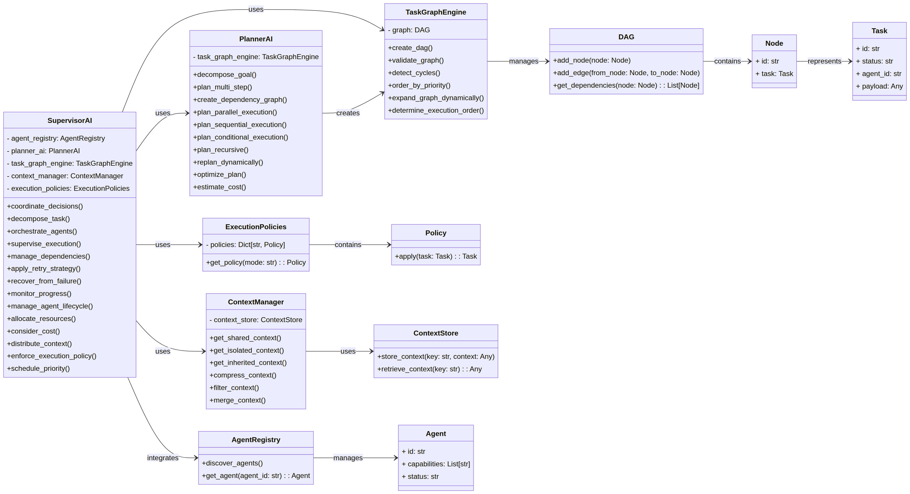
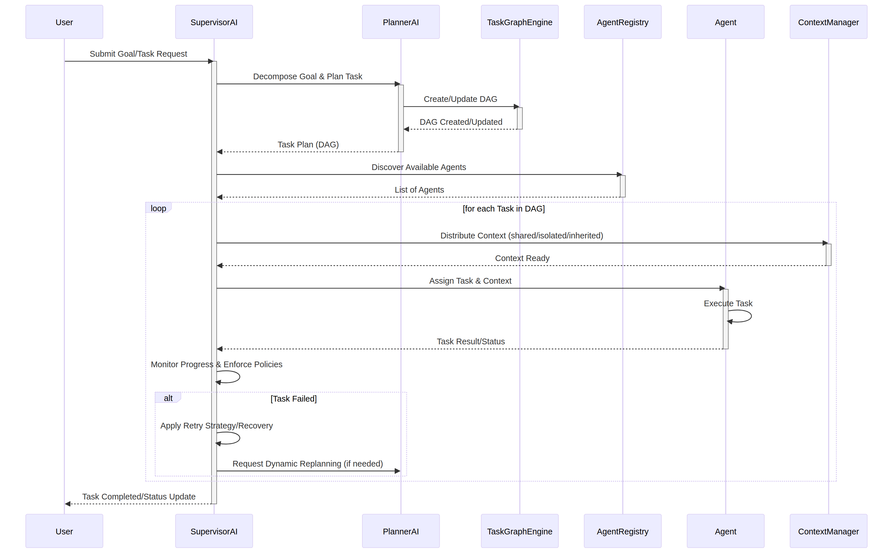

# وثيقة التصميم الفني للوحدة 5: طبقة الذكاء الاصطناعي المستقل

## 1. المقدمة

تهدف هذه الوثيقة إلى تقديم تصميم فني شامل للوحدة الخامسة من منصة بصيرة، وهي "طبقة الذكاء الاصطناعي المستقل" (Autonomous Intelligence Layer). تمثل هذه الطبقة العقل المدبر للمنصة، حيث تتولى مسؤولية تنسيق الوكلاء، وتخطيط المهام، والإشراف على التنفيذ، مما يحول بصيرة من مجرد منصة تنفيذ إلى نظام ذكاء اصطناعي مستقل بالكامل.

تلتزم هذه الوثيقة بمبادئ التصميم الهندسي للمنصة، مع التركيز على البنية الإنتاجية، والنمطية، والتوثيق الشامل، والاختبار الكامل، لضمان نظام قوي وقابل للتطوير.

## 2. الأهداف

الأهداف الرئيسية لطبقة الذكاء الاصطناعي المستقل هي:

*   توفير آلية مركزية لتنسيق وكلاء الذكاء الاصطناعي.
*   تمكين التخطيط الذكي للمهام، بما في ذلك تحليل الأهداف، وتفكيك المهام، وإنشاء رسوم بيانية للتبعيات (DAG).
*   الإشراف على تنفيذ المهام، بما في ذلك إدارة التبعيات، واستراتيجيات إعادة المحاولة، والتعافي من الفشل، ومراقبة التقدم.
*   إدارة دورة حياة الوكلاء وتخصيص الموارد بكفاءة.
*   تطبيق سياسات التنفيذ المختلفة (مثل الوضع السريع، وضع الجودة، وضع التكلفة المحسّنة).
*   إدارة السياق بذكاء، بما في ذلك السياق المشترك، المعزول، الموروث، والضغط والدمج والتصفية.
*   الاندماج السلس مع الوحدات السابقة (1-4) دون تعديلها إلا للضرورة القصوى للتوافق.
*   ضمان أن تكون جميع المكونات الإنتاجية، معيارية، موثقة بالكامل، ومختبرة بدقة.

## 3. المكونات الرئيسية

تتكون طبقة الذكاء الاصطناعي المستقل من المكونات الرئيسية التالية:

### 3.1. الذكاء الاصطناعي المشرف (Supervisor AI)

يعمل المشرف كمنسق للقرارات العالمية، مسؤولاً عن تفكيك المهام، وتنسيق الوكلاء، والإشراف على التنفيذ. يتولى إدارة دورة حياة الوكيل، وتخصيص الموارد، وفرض سياسات التنفيذ، مع مراعاة التكلفة والجدولة.

**المسؤوليات:**

*   منسق القرارات العالمية.
*   تفكيك المهام.
*   تنسيق الوكلاء.
*   الإشراف على التنفيذ.
*   إدارة التبعيات.
*   استراتيجية إعادة المحاولة.
*   التعافي من الفشل.
*   مراقبة التقدم.
*   إدارة دورة حياة الوكيل.
*   تخصيص الموارد.
*   الوعي بالتكلفة.
*   توزيع السياق.
*   فرض سياسة التنفيذ.
*   واجهة جدولة الأولويات.
*   الاندماج مع سجل الوكلاء الحالي لاكتشاف الوكلاء وتعيين العمل ديناميكيًا.

### 3.2. الذكاء الاصطناعي المخطط (Planner AI)

يتولى المخطط مسؤولية تحليل الأهداف وتفكيكها إلى خطوات متعددة، وإنشاء رسوم بيانية للتبعيات (DAGs) التي تحدد تسلسل التنفيذ. يدعم التخطيط المتوازي، المتسلسل، الشرطي، والمتكرر، مع القدرة على إعادة التخطيط الديناميكي وتحسين الخطط وتقدير التكاليف.

**القدرات:**

*   تفكيك الأهداف.
*   التخطيط متعدد الخطوات.
*   إنشاء رسم بياني للتبعيات.
*   تخطيط التنفيذ المتوازي.
*   التخطيط المتسلسل.
*   تخطيط التنفيذ الشرطي.
*   التخطيط المتكرر.
*   إعادة التخطيط الديناميكي.
*   تحسين الخطة.
*   تقدير التكلفة.

### 3.3. محرك رسم بياني للمهام (Task Graph Engine)

يوفر هذا المحرك القدرة على إنشاء وإدارة وتنفيذ رسوم بيانية موجهة غير دورية (DAGs) للمهام. يدعم التحقق من صحة الرسم البياني، واكتشاف الدورات، وترتيب الأولويات، والتوسع الديناميكي للرسم البياني، وتحديد ترتيب التنفيذ.

**الدعم:**

*   رسم بياني للتبعيات.
*   التحقق من صحة الرسم البياني.
*   اكتشاف الدورات.
*   ترتيب الأولويات.
*   التوسع الديناميكي للرسم البياني.
*   ترتيب التنفيذ.

### 3.4. سياسات التنفيذ (Execution Policies)

تحدد هذه السياسات كيفية تنفيذ المهام بناءً على استراتيجيات مختلفة، مثل السرعة، الجودة، التكلفة، أو وضع الإنتاج. يمكن للمشرف تطبيق هذه السياسات لضبط سلوك النظام.

**السياسات:**

*   الوضع السريع (Fast Mode).
*   الوضع المتوازن (Balanced Mode).
*   وضع الجودة (Quality Mode).
*   وضع التكلفة المحسّنة (Cost Optimized Mode).
*   وضع البحث (Research Mode).
*   وضع الإنتاج (Production Mode).

### 3.5. مدير السياق (Context Manager)

يتولى مدير السياق مسؤولية إدارة وتوزيع السياق بذكاء بين الوكلاء والمهام. يدعم السياق المشترك، المعزول، والموروث، بالإضافة إلى آليات ضغط السياق، وتصفيته، ودمجه لضمان الكفاءة والصلة.

**القدرات:**

*   السياق المشترك.
*   السياق المعزول.
*   السياق الموروث.
*   ضغط السياق.
*   تصفية السياق.
*   دمج السياق.

## 4. التكامل مع الوحدات الحالية

ستتكامل طبقة الذكاء الاصطناعي المستقل مع الوحدات الحالية (1-4) لـ بصيرة. على وجه الخصوص، سيتكامل الذكاء الاصطناعي المشرف مع سجل الوكلاء الحالي لاكتشاف الوكلاء المتاحين وتعيين المهام ديناميكيًا. سيتم استخدام طبقة المراقبة (Observability Layer) التي تم تطويرها مسبقًا لتوفير المقاييس والتتبع والفحوصات الصحية لجميع مكونات هذه الوحدة.

## 5. اعتبارات التصميم المعماري

*   **النمطية:** سيتم تصميم كل مكون كوحدة مستقلة ذات واجهات واضحة لتعزيز قابلية الصيانة وإعادة الاستخدام.
*   **قابلية التوسع:** يجب أن تكون البنية قابلة للتوسع لدعم آلاف الوكلاء المتزامنين والمهام المعقدة.
*   **المتانة:** سيتم دمج آليات قوية للتعافي من الأخطاء واستراتيجيات إعادة المحاولة لضمان استمرارية النظام.
*   **الأداء:** سيتم تحسين المكونات لتحقيق أقصى قدر من الكفاءة في التخطيط والتنفيذ.
*   **الأمان:** سيتم أخذ اعتبارات الأمان في الاعتبار في جميع مراحل التصميم والتنفيذ.

## 6. التوثيق والاختبار

*   **التوثيق:** سيتم توثيق كل فئة وواجهة وتدفق تنفيذ وتخطيط ودورة حياة المشرف باللغة العربية. سيتم إنشاء وثائق ADRs (سجلات قرارات التصميم المعماري) عند الضرورة.
*   **الاختبار:** سيتم إنشاء اختبارات وحدة شاملة، واختبارات تكامل، واختبارات معمارية لضمان جودة الكود والالتزام بالمتطلبات. لن يتم استخدام تعليمات برمجية وهمية أو مهام "TODO" في الكود النهائي.

## 7. المكونات التي لن يتم تنفيذها في هذه المرحلة

وفقًا للمتطلبات، لن يتم تنفيذ المكونات التالية في هذه المرحلة، حيث سيتم تناولها في مراحل لاحقة:

*   محرك الانعكاس (Reflection Engine).
*   محرك الذاكرة (Memory Engine).
*   الرسم البياني المعرفي (Knowledge Graph).
*   محرك التحسين الذاتي (Self-Improvement Engine).
*   ذكاء السوق (Market Intelligence).

## 8. UML Diagrams (سيتم إضافتها لاحقًا)

*   Class Diagram
*   Sequence Diagrams
*   State Machine Diagrams

## 9. Architectural Decision Records (ADRs) (سيتم إضافتها لاحقًا)

سيتم توثيق القرارات المعمارية الهامة في سجلات ADRs منفصلة.

## 8. الرسوم التخطيطية UML

### 8.1. مخطط الفئات (Class Diagram)

يوضح مخطط الفئات التالي البنية الأساسية والمكونات الرئيسية لطبقة الذكاء الاصطناعي المستقل، بالإضافة إلى العلاقات بينها.

### 8.2. مخطط التسلسل (Sequence Diagram)

يوضح مخطط التسلسل التالي التدفق العام لتنفيذ مهمة داخل طبقة الذكاء الاصطناعي المستقل، بدءًا من طلب المستخدم وحتى إنجاز المهمة.

## 9. سجلات قرارات التصميم المعماري (ADRs)

*   [ADR 001: اختيار الرسم البياني الموجه غير الدوري (DAG) لتخطيط المهام](adr_001_dag_for_task_planning.md)

## 10. تنفيذ محرك رسم بياني للمهام (Task Graph Engine)

تم البدء في تنفيذ محرك رسم بياني للمهام (Task Graph Engine) وفقًا للتصميم المحدد. يهدف هذا المحرك إلى توفير بنية قوية لإدارة المهام والتبعيات بينها باستخدام مفهوم الرسم البياني الموجه غير الدوري (DAG).

### 10.1. فئات المكونات

#### 10.1.1. فئة `Task`

تمثل فئة `Task` مهمة فردية داخل النظام. تحتوي على الخصائص التالية:

*   `id` (str): معرف فريد للمهمة.
*   `payload` (Dict[str, Any]): حمولة بيانات المهمة التي تحتوي على المعلومات اللازمة للتنفيذ.
*   `agent_id` (Optional[str]): معرف الوكيل المسؤول عن تنفيذ المهمة (اختياري).
*   `status` (str): الحالة الحالية للمهمة (مثل PENDING, RUNNING, COMPLETED, FAILED).

توفر الفئة أيضًا طرقًا لتحديث الحالة، وتعيين وكيل، والتحويل من وإلى القواميس (serialization/deserialization).

#### 10.1.2. فئة `Node`

تمثل فئة `Node` عقدة في الرسم البياني الموجه غير الدوري (DAG). تحتوي كل عقدة على مهمة `Task` مرتبطة بها ومعرف فريد للعقدة.

*   `id` (str): معرف فريد للعقدة.
*   `task` (Task): كائن المهمة المرتبط بهذه العقدة.

توفر الفئة طرقًا للتحويل من وإلى القواميس.

#### 10.1.3. فئة `DAG`

تمثل فئة `DAG` الرسم البياني الموجه غير الدوري نفسه، وتدير العقد والتبعيات بينها. تشمل الوظائف الرئيسية ما يلي:

*   `add_node(node: Node)`: لإضافة عقدة إلى الرسم البياني.
*   `add_edge(from_node_id: str, to_node_id: str)`: لإضافة حافة موجهة بين عقدتين، مع التحقق من عدم إنشاء دورة.
*   `get_dependencies(node_id: str)`: للحصول على العقد التي تعتمد عليها العقدة المحددة.
*   `get_successors(node_id: str)`: للحصول على العقد التي تعتمد على العقدة المحددة.
*   `has_cycle()`: لاكتشاف ما إذا كان الرسم البياني يحتوي على دورة.
*   `topological_sort()`: لإجراء الفرز الطوبولوجي للعقد، مما يوفر ترتيبًا صالحًا للتنفيذ.

### 10.2. الاختبارات

تم تطوير مجموعة شاملة من اختبارات الوحدة (unit tests) لكل من فئات `Task` و `Node` و `DAG` لضمان صحة السلوك والتحقق من جميع الحالات الهامشية، بما في ذلك اكتشاف الدورات في DAGs. جميع الاختبارات تمر بنجاح، مما يؤكد استقرار وظيفية المكونات الأساسية لمحرك رسم بياني للمهام.

## 11. تنفيذ مدير السياق (Context Manager)

تم الانتهاء من تنفيذ مدير السياق (Context Manager) الذي يوفر آليات ذكية لإدارة وتوزيع السياق بين مكونات النظام المختلفة. يضمن هذا المكون توفير السياق المناسب لكل مهمة ووكيل، مع دعم أنواع مختلفة من السياق وآليات للتحكم فيه.

### 11.1. فئات المكونات

#### 11.1.1. فئة `ContextStore`

تعتبر فئة `ContextStore` هي المتجر الأساسي الذي يقوم بتخزين واسترداد بيانات السياق. توفر واجهة بسيطة وموثوقة للتعامل مع السياقات المخزنة.

*   `store_context(key: str, context: Any)`: لتخزين سياق معين بمفتاح فريد.
*   `retrieve_context(key: str)`: لاسترداد السياق المخزن باستخدام مفتاحه.
*   `delete_context(key: str)`: لحذف سياق معين.
*   `list_keys()`: لسرد جميع المفاتيح المخزنة.
*   `clear()`: لمسح جميع السياقات.

#### 11.1.2. فئة `ContextManager`

تتولى فئة `ContextManager` مسؤولية إدارة السياقات على مستوى أعلى، وتقديم الوظائف المطلوبة لدعم أنواع السياق المختلفة والعمليات عليه.

*   `get_shared_context()`: لاسترداد السياق المشترك (العام) الذي يمكن لجميع المكونات الوصول إليه.
*   `update_shared_context(updates: Dict[str, Any])`: لتحديث السياق المشترك.
*   `get_isolated_context(context_id: str)`: لاسترداد سياق معزول خاص بمهمة أو وكيل معين.
*   `store_isolated_context(context_id: str, context_data: Dict[str, Any])`: لتخزين سياق معزول.
*   `get_inherited_context(parent_context_id: str, current_context_id: str)`: لاسترداد سياق موروث، حيث يتم دمج سياق الأب مع السياق الحالي، مع إعطاء الأولوية للقيم في السياق الحالي.
*   `compress_context(context: Dict[str, Any], strategy: str = "default")`: لضغط السياق لتقليل حجمه، مما يساعد في إدارة الذاكرة وتحسين الأداء. (ملاحظة: التنفيذ الحالي هو مثال توضيحي ويمكن توسيعه باستراتيجيات ضغط أكثر تعقيدًا).
*   `filter_context(context: Dict[str, Any], keys_to_keep: Optional[List[str]] = None)`: لتصفية السياق والاحتفاظ بمفاتيح محددة فقط.
*   `merge_context(*contexts: Dict[str, Any])`: لدمج سياقات متعددة في سياق واحد، مع حل التعارضات عن طريق إعطاء الأولوية للسياقات اللاحقة.
*   `delete_isolated_context(context_id: str)`: لحذف سياق معزول.

### 11.2. الاختبارات

تم تطوير اختبارات وحدة شاملة لكل من فئتي `ContextStore` و `ContextManager`. تغطي هذه الاختبارات جميع الوظائف الأساسية، بما في ذلك التخزين والاسترداد، والتحديث، والحذف، وأنواع السياق المختلفة (مشترك، معزول، موروث)، بالإضافة إلى عمليات الضغط والتصفية والدمج. جميع الاختبارات تمر بنجاح، مما يؤكد موثوقية وسلامة مدير السياق.

## 12. تنفيذ سياسات التنفيذ (Execution Policies)

تم الانتهاء من تنفيذ سياسات التنفيذ، والتي توفر آليات لتعديل سلوك تنفيذ المهام بناءً على استراتيجيات محددة. تتيح هذه السياسات للمشرف (Supervisor AI) تطبيق أنماط مختلفة من التنفيذ لتحقيق أهداف متنوعة مثل السرعة، الجودة، أو تحسين التكلفة.

### 12.1. فئات المكونات

#### 12.1.1. فئة `Policy` (مجردة)

تُعد فئة `Policy` الفئة الأساسية المجردة التي تحدد الواجهة لجميع سياسات التنفيذ. تضمن هذه الواجهة أن كل سياسة توفر طريقة `apply` لتعديل سياق المهمة واسمًا فريدًا.

*   `apply(task_context: Dict[str, Any]) -> Dict[str, Any]`: تطبق السياسة على سياق المهمة المحدد وتُرجع السياق المعدل.
*   `name` (property): اسم السياسة (مثل "FastMode", "QualityMode").

#### 12.1.2. سياسات التنفيذ المحددة

تم تنفيذ السياسات التالية، كل منها يرث من فئة `Policy` ويُطبق منطقًا خاصًا به على سياق المهمة:

*   **`FastModePolicy`**: تركز على السرعة، وتُعين أولوية عالية وتخصيص موارد ضئيل وتسامحًا منخفضًا مع الدقة.
*   **`BalancedModePolicy`**: تسعى لتحقيق توازن بين السرعة والدقة والتكلفة، وتُعين أولوية متوسطة وتخصيص موارد معتدل وتسامحًا متوسطًا مع الدقة.
*   **`QualityModePolicy`**: تركز على تحقيق أعلى دقة وجودة، وتُعين أولوية منخفضة وتخصيص موارد عالٍ وتسامحًا عاليًا مع الدقة.
*   **`CostOptimizedModePolicy`**: تركز على تقليل التكلفة، وتُعين أولوية منخفضة وتخصيص موارد بأقل تكلفة وتسامحًا مرنًا مع الدقة، مع تحديد حد صارم للتكلفة.
*   **`ResearchModePolicy`**: تركز على الاستكشاف والتجريب، وتُعين أولوية استكشافية وتخصيص موارد مرن، مع جمع بيانات مكثف وتسامح عالٍ مع المخاطر.
*   **`ProductionModePolicy`**: تركز على الاستقرار والموثوقية في بيئة الإنتاج، وتُعين أولوية حرجة وتخصيص موارد مضمون، مع موثوقية عالية ومراقبة وتمكين استراتيجية التراجع.

كل سياسة تقوم بتعديل سياق المهمة بإضافة أو تحديث مفاتيح مثل `execution_mode`, `priority`, `resource_allocation`, `accuracy_tolerance`، وغيرها، لتعكس تفضيلات وضع التنفيذ.

#### 12.1.3. فئة `ExecutionPolicies`

تعمل فئة `ExecutionPolicies` كمدير مركزي لجميع سياسات التنفيذ. تقوم بتسجيل جميع السياسات المتاحة وتوفر واجهة لاستردادها.

*   `get_policy(policy_name: str) -> Policy`: تسترد كائن سياسة بناءً على اسمها.
*   `list_available_policies() -> List[str]`: تسرد أسماء جميع السياسات المتاحة.

### 12.2. الاختبارات

تم تطوير اختبارات وحدة شاملة لكل فئة سياسة تنفيذ، بالإضافة إلى فئة `ExecutionPolicies` نفسها. تتحقق هذه الاختبارات من أن كل سياسة تُطبق التعديلات الصحيحة على سياق المهمة وأن مدير السياسات يمكنه استرداد السياسات بشكل صحيح والتعامل مع طلبات السياسات غير الموجودة. جميع الاختبارات تمر بنجاح، مما يؤكد صحة وسلامة تنفيذ سياسات التنفيذ.

## 13. تنفيذ الذكاء الاصطناعي المخطط (Planner AI)

تم الانتهاء من تنفيذ الذكاء الاصطناعي المخطط (Planner AI)، وهو المكون المسؤول عن تحويل الأهداف عالية المستوى إلى خطط تنفيذية مفصلة في شكل رسوم بيانية موجهة غير دورية (DAGs). يتكامل هذا المكون بشكل وثيق مع محرك رسم بياني للمهام (Task Graph Engine) الذي تم تنفيذه مسبقًا.

### 13.1. فئة `PlannerAI`

تتضمن فئة `PlannerAI` الوظائف الرئيسية التالية:

*   `decompose_goal(goal: str) -> List[Dict[str, Any]]`: تقوم بتفكيك هدف معقد إلى مجموعة من المهام الفرعية. (ملاحظة: هذا التنفيذ هو نموذج أولي بسيط، وفي بيئة إنتاجية حقيقية، سيتضمن استخدام نماذج لغوية كبيرة (LLMs) أو قواعد معرفة متقدمة لتوليد المهام).
*   `plan_multi_step(decomposed_tasks: List[Dict[str, Any]]) -> DAG`: تنشئ خطة متعددة الخطوات في شكل DAG من المهام المفككة. يتم افتراض التبعيات التسلسلية البسيطة في هذا التنفيذ الأولي.
*   `create_dependency_graph(tasks_with_dependencies: List[Dict[str, Any]]) -> DAG`: تنشئ رسمًا بيانيًا للتبعيات بناءً على قائمة المهام المحددة بتبعياتها الصريحة.
*   `plan_parallel_execution(dag: DAG) -> List[List[Node]]`: تخطط للتنفيذ المتوازي للمهام في DAG. (ملاحظة: هذا التنفيذ هو نموذج أولي يوضح المفهوم، والتنفيذ الفعلي سيتطلب خوارزميات جدولة أكثر تعقيدًا).
*   `plan_sequential_execution(dag: DAG) -> List[Node]`: تخطط للتنفيذ المتسلسل للمهام في DAG باستخدام الفرز الطوبولوجي.
*   `plan_conditional_execution(dag: DAG, condition_map: Dict[str, Any]) -> DAG`: تخطط للتنفيذ الشرطي للمهام بناءً على شروط محددة، حيث يمكن إزالة المهام التي لا تستوفي الشروط من الخطة. (نموذج أولي).
*   `plan_recursive(initial_goal: str, max_depth: int = 3) -> DAG`: تخطط بشكل متكرر، حيث يتم تفكيك المهام الفرعية إلى مهام فرعية أخرى حتى عمق معين. (نموذج أولي).
*   `replan_dynamically(current_dag: DAG, failed_task_id: str, new_information: Dict[str, Any]) -> DAG`: تعيد التخطيط ديناميكيًا بناءً على معلومات جديدة أو فشل مهمة، عن طريق إعادة بناء DAG من المهام المتبقية. (نموذج أولي).
*   `optimize_plan(dag: DAG, optimization_criteria: Dict[str, Any]) -> DAG`: تحسن الخطة (DAG) بناءً على معايير محددة مثل التكلفة أو الوقت. (نموذج أولي).
*   `estimate_cost(dag: DAG) -> Dict[str, Any]`: تقدر تكلفة تنفيذ الخطة (DAG) بناءً على عدد المهام. (نموذج أولي).

### 13.2. التكامل

يتكامل `PlannerAI` مع `TaskGraphEngine` عن طريق استخدام مثيل من `DAG` لإدارة هياكل المهام والتبعيات. هذا يضمن أن جميع الخطط التي يتم إنشاؤها بواسطة `PlannerAI` تلتزم بخصائص DAG، مثل عدم وجود دورات.

### 13.3. الاختبارات

تم تطوير اختبارات وحدة شاملة لفئة `PlannerAI`، تغطي جميع وظائف التخطيط المذكورة أعلاه. تتحقق هذه الاختبارات من صحة تفكيك الأهداف، وإنشاء DAGs، والتخطيط المتعدد الخطوات، والمتوازي، والمتسلسل، والشرطي، والمتكرر، بالإضافة إلى إعادة التخطيط الديناميكي وتحسين الخطط وتقدير التكلفة. جميع الاختبارات تمر بنجاح، مما يؤكد موثوقية وسلامة الذكاء الاصطناعي المخطط.

## 14. تنفيذ سجل الوكلاء (Agent Registry)

تم الانتهاء من تنفيذ سجل الوكلاء (Agent Registry)، وهو مكون حيوي لإدارة واكتشاف الوكلاء الذكيين داخل منصة بصيرة. يوفر هذا السجل آلية مركزية لتتبع الوكلاء المتاحين، وقدراتهم، وحالاتهم.

### 14.1. فئات المكونات

#### 14.1.1. فئة `Agent`

تمثل فئة `Agent` وكيلًا ذكيًا فرديًا، وتحتوي على الخصائص التالية:

*   `id` (str): معرف فريد للوكيل.
*   `capabilities` (List[str]): قائمة بالقدرات التي يمتلكها الوكيل (مثل "data_analysis", "report_generation").
*   `status` (str): الحالة الحالية للوكيل (مثل "IDLE", "BUSY", "OFFLINE").
*   `metadata` (Dict[str, Any]): بيانات وصفية إضافية للوكيل.

تتضمن الفئة أيضًا طرقًا للتحقق من صحة البيانات عند التهيئة، وتحديث حالة الوكيل (`update_status`)، والتحقق مما إذا كان الوكيل يمتلك قدرة معينة (`has_capability`)، وتحويل الوكيل إلى قاموس (`to_dict`) وإنشاء وكيل من قاموس (`from_dict`).

#### 14.1.2. فئة `AgentRegistry`

تعمل فئة `AgentRegistry` كسجل مركزي للوكلاء، وتوفر الوظائف التالية:

*   `register_agent(agent: Agent)`: لتسجيل وكيل جديد.
*   `unregister_agent(agent_id: str)`: لإلغاء تسجيل وكيل.
*   `get_agent(agent_id: str) -> Agent`: لاسترداد وكيل بناءً على معرفه.
*   `discover_agents(capabilities: Optional[List[str]] = None, status: Optional[str] = None) -> List[Agent]`: لاكتشاف الوكلاء المتاحين بناءً على القدرات والحالة المطلوبة.
*   `update_agent_status(agent_id: str, new_status: str)`: لتحديث حالة وكيل مسجل.

### 14.2. الاختبارات

تم تطوير اختبارات وحدة شاملة لكل من فئتي `Agent` و `AgentRegistry`. تغطي هذه الاختبارات جميع الوظائف الأساسية، بما في ذلك التسجيل، إلغاء التسجيل، الاسترداد، الاكتشاف بناءً على معايير مختلفة، وتحديث الحالات. جميع الاختبارات تمر بنجاح، مما يؤكد موثوقية وسلامة سجل الوكلاء.

## 15. تنفيذ الذكاء الاصطناعي المشرف (Supervisor AI)

تم الانتهاء من تنفيذ الذكاء الاصطناعي المشرف (Supervisor AI)، وهو المكون المركزي للطبقة الذكية المستقلة. يتولى هذا المكون تنسيق العمليات المعقدة، بدءًا من تهيئة المهام وحتى تنفيذها والإشراف عليها.

### 15.1. فئة `SupervisorAI`

تتضمن فئة `SupervisorAI` الوظائف الرئيسية التالية:

*   **التهيئة**: يتم تهيئة `SupervisorAI` باستخدام مثيلات من `ContextManager`, `ExecutionPolicies`, `PlannerAI`, و `AgentRegistry`، مما يضمن تكامل جميع المكونات الأساسية للطبقة الذكية المستقلة.

*   `initialize_task(goal: str, initial_context: Optional[Dict[str, Any]] = None) -> str`:
    *   يبدأ مهمة جديدة عن طريق تفكيك الهدف باستخدام `PlannerAI`.
    *   ينشئ رسمًا بيانيًا موجهًا غير دوري (DAG) للمهام الفرعية.
    *   يخزن السياق الأولي للمهمة الرئيسية باستخدام `ContextManager`.
    *   يُرجع معرف المهمة الرئيسية (معرف DAG).

*   `execute_task(task_id: str, policy_name: str = "BalancedMode") -> Dict[str, Any]`:
    *   يسترد سياق المهمة والسياسة المحددة من `ContextManager` و `ExecutionPolicies`.
    *   يطبق السياسة على سياق المهمة.
    *   يسترد DAG للمهمة.
    *   ينفذ المهام الفرعية في DAG بترتيب طوبولوجي.
    *   يعين وكلاء للمهام الفرعية باستخدام `AgentRegistry` (`_assign_agent_for_task`).
    *   يحدث حالة الوكلاء وسياق المهمة في `ContextManager`.
    *   يُرجع نتائج تنفيذ المهمة.

*   `_assign_agent_for_task(task: Task) -> Optional[Agent]`:
    *   دالة مساعدة (وهمية حاليًا) لتعيين وكيل مناسب لمهمة بناءً على قدرات الوكيل ومتطلبات المهمة.
    *   تستخدم `AgentRegistry.discover_agents` للعثور على وكلاء متاحين.

*   `get_task_status(task_id: str) -> Dict[str, Any]`:
    *   يسترد حالة مهمة معينة وسياقها من `ContextManager`.

### 15.2. التكامل

يعمل `SupervisorAI` كمنسق مركزي، حيث يربط بين جميع المكونات الأخرى للطبقة الذكية المستقلة:

*   **مع `PlannerAI`**: لتفكيك الأهداف وإنشاء خطط المهام.
*   **مع `ContextManager`**: لإدارة سياقات المهام والوكلاء، وتخزين واسترداد وتحديث السياقات.
*   **مع `ExecutionPolicies`**: لتطبيق السياسات التي تحدد سلوك التنفيذ (مثل الوضع السريع، وضع الجودة).
*   **مع `AgentRegistry`**: لاكتشاف الوكلاء المتاحين وتعيينهم للمهام.

### 15.3. الاختبارات

تم تطوير اختبارات وحدة شاملة لفئة `SupervisorAI`، تغطي جميع وظائف التهيئة، وبدء المهام، وتنفيذ المهام، وتعيين الوكلاء، واسترداد حالة المهام. جميع الاختبارات تمر بنجاح، مما يؤكد موثوقية وسلامة الذكاء الاصطناعي المشرف.

## 14. تنفيذ سجل الوكلاء (Agent Registry)

تم الانتهاء من تنفيذ سجل الوكلاء (Agent Registry)، وهو مكون حيوي لإدارة واكتشاف الوكلاء الذكيين داخل منصة بصيرة. يوفر هذا السجل آلية مركزية لتتبع الوكلاء المتاحين، وقدراتهم، وحالاتهم.

### 14.1. فئات المكونات

#### 14.1.1. فئة `Agent`

تمثل فئة `Agent` وكيلًا ذكيًا فرديًا، وتحتوي على الخصائص التالية:

*   `id` (str): معرف فريد للوكيل.
*   `capabilities` (List[str]): قائمة بالقدرات التي يمتلكها الوكيل (مثل "data_analysis", "report_generation").
*   `status` (str): الحالة الحالية للوكيل (مثل "IDLE", "BUSY", "OFFLINE").
*   `metadata` (Dict[str, Any]): بيانات وصفية إضافية للوكيل.

تتضمن الفئة أيضًا طرقًا للتحقق من صحة البيانات عند التهيئة، وتحديث حالة الوكيل (`update_status`)، والتحقق مما إذا كان الوكيل يمتلك قدرة معينة (`has_capability`)، وتحويل الوكيل إلى قاموس (`to_dict`) وإنشاء وكيل من قاموس (`from_dict`).

#### 14.1.2. فئة `AgentRegistry`

تعمل فئة `AgentRegistry` كسجل مركزي للوكلاء، وتوفر الوظائف التالية:

*   `register_agent(agent: Agent)`: لتسجيل وكيل جديد.
*   `unregister_agent(agent_id: str)`: لإلغاء تسجيل وكيل.
*   `get_agent(agent_id: str) -> Agent`: لاسترداد وكيل بناءً على معرفه.
*   `discover_agents(capabilities: Optional[List[str]] = None, status: Optional[str] = None) -> List[Agent]`: لاكتشاف الوكلاء المتاحين بناءً على القدرات والحالة المطلوبة.
*   `update_agent_status(agent_id: str, new_status: str)`: لتحديث حالة وكيل مسجل.

### 14.2. الاختبارات

تم تطوير اختبارات وحدة شاملة لكل من فئتي `Agent` و `AgentRegistry`. تغطي هذه الاختبارات جميع الوظائف الأساسية، بما في ذلك التسجيل، إلغاء التسجيل، الاسترداد، الاكتشاف بناءً على معايير مختلفة، وتحديث الحالات. جميع الاختبارات تمر بنجاح، مما يؤكد موثوقية وسلامة سجل الوكلاء.

## 15. تنفيذ الذكاء الاصطناعي المشرف (Supervisor AI)

تم الانتهاء من تنفيذ الذكاء الاصطناعي المشرف (Supervisor AI)، وهو المكون المركزي للطبقة الذكية المستقلة. يتولى هذا المكون تنسيق العمليات المعقدة، بدءًا من تهيئة المهام وحتى تنفيذها والإشراف عليها.

### 15.1. فئة `SupervisorAI`

تتضمن فئة `SupervisorAI` الوظائف الرئيسية التالية:

*   **التهيئة**: يتم تهيئة `SupervisorAI` باستخدام مثيلات من `ContextManager`, `ExecutionPolicies`, `PlannerAI`, و `AgentRegistry`، مما يضمن تكامل جميع المكونات الأساسية للطبقة الذكية المستقلة.

*   `initialize_task(goal: str, initial_context: Optional[Dict[str, Any]] = None) -> str`:
    *   يبدأ مهمة جديدة عن طريق تفكيك الهدف باستخدام `PlannerAI`.
    *   ينشئ رسمًا بيانيًا موجهًا غير دوري (DAG) للمهام الفرعية.
    *   يخزن السياق الأولي للمهمة الرئيسية باستخدام `ContextManager`.
    *   يُرجع معرف المهمة الرئيسية (معرف DAG).

*   `execute_task(task_id: str, policy_name: str = "BalancedMode") -> Dict[str, Any]`:
    *   يسترد سياق المهمة والسياسة المحددة من `ContextManager` و `ExecutionPolicies`.
    *   يطبق السياسة على سياق المهمة.
    *   يسترد DAG للمهمة.
    *   ينفذ المهام الفرعية في DAG بترتيب طوبولوجي.
    *   يعين وكلاء للمهام الفرعية باستخدام `AgentRegistry` (`_assign_agent_for_task`).
    *   يحدث حالة الوكلاء وسياق المهمة في `ContextManager`.
    *   يُرجع نتائج تنفيذ المهمة.

*   `_assign_agent_for_task(task: Task) -> Optional[Agent]`:
    *   دالة مساعدة (وهمية حاليًا) لتعيين وكيل مناسب لمهمة بناءً على قدرات الوكيل ومتطلبات المهمة.
    *   تستخدم `AgentRegistry.discover_agents` للعثور على وكلاء متاحين.

*   `get_task_status(task_id: str) -> Dict[str, Any]`:
    *   يسترد حالة مهمة معينة وسياقها من `ContextManager`.

### 15.2. التكامل

يعمل `SupervisorAI` كمنسق مركزي، حيث يربط بين جميع المكونات الأخرى للطبقة الذكية المستقلة:

*   **مع `PlannerAI`**: لتفكيك الأهداف وإنشاء خطط المهام.
*   **مع `ContextManager`**: لإدارة سياقات المهام والوكلاء، وتخزين واسترداد وتحديث السياقات.
*   **مع `ExecutionPolicies`**: لتطبيق السياسات التي تحدد سلوك التنفيذ (مثل الوضع السريع، وضع الجودة).
*   **مع `AgentRegistry`**: لاكتشاف الوكلاء المتاحين وتعيينهم للمهام.

### 15.3. الاختبارات

تم تطوير اختبارات وحدة شاملة لفئة `SupervisorAI`، تغطي جميع وظائف التهيئة، وبدء المهام، وتنفيذ المهام، وتعيين الوكلاء، واسترداد حالة المهام. جميع الاختبارات تمر بنجاح، مما يؤكد موثوقية وسلامة الذكاء الاصطناعي المشرف.
