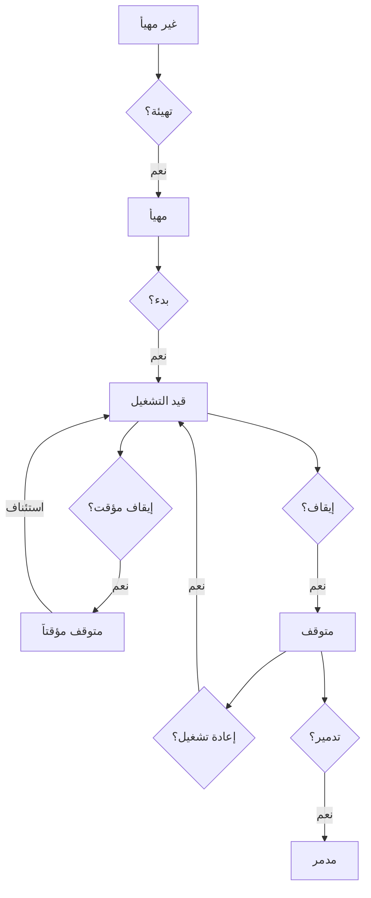
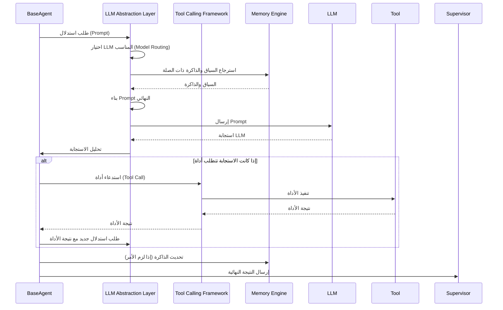
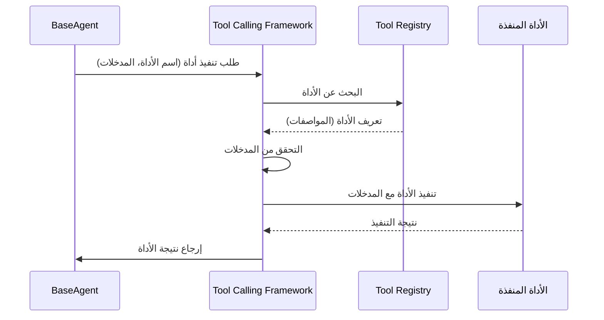
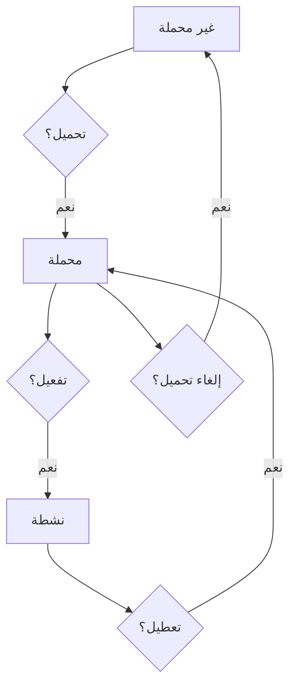
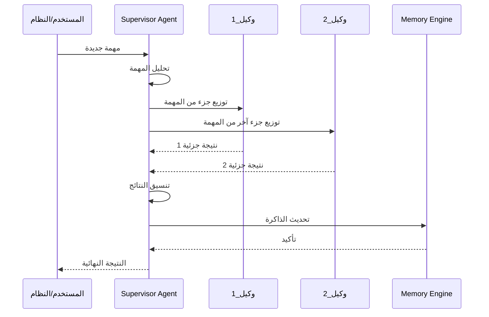

# Technical Design Specification v1.0 - منصة بصيرة

**النسخة:** v1.0
**التاريخ:** 14 يوليو 2026
**المؤلف:** Manus AI (بصفتي كبير مهندسي البرمجيات)

## 1. نظرة عامة تقنية على المشروع (Project Technical Overview)

تقدم هذه الوثيقة المواصفات الفنية التفصيلية لمنصة "بصيرة"، وتعتبر المرجع التقني النهائي لجميع جوانب التنفيذ البرمجي. تهدف إلى توفير فهم معمق للهيكل الداخلي، الوحدات، تدفق البيانات، وآليات العمل، لضمان تنفيذ متسق وعالي الجودة يتماشى مع المعايير المؤسسية العالمية.

### 1.1 الغرض (Purpose)

*   تحديد جميع القرارات التقنية بشكل لا يترك مجالاً للتخمين أثناء التنفيذ.
*   توفير مخطط تفصيلي للكود، الوحدات، والطبقات.
*   ضمان الاتساق في التصميم والتنفيذ عبر جميع فرق التطوير.
*   تسهيل عملية المراجعة، الصيانة، والتوسع المستقبلي للمنصة.

### 1.2 نطاق الوثيقة (Document Scope)

تغطي هذه الوثيقة جميع الجوانب التقنية لمنصة "بصيرة"، بدءًا من هيكل المستودع وصولاً إلى استراتيجيات النشر والأمان، مع التركيز بشكل خاص على تصميم BaseAgent، نظام الذاكرة، إدارة الـ Prompts، وإطار عمل استدعاء الأدوات.

### 1.3 الجمهور المستهدف (Target Audience)

*   مهندسو البرمجيات والمطورون.
*   مهندسو DevOps.
*   مهندسو ضمان الجودة (QA Engineers).
*   مهندسو الأمن.
*   القيادة التقنية.

## 2. هيكل المستودع (Repository Structure)

يوضح هذا القسم الهيكل الكامل للمجلدات والملفات داخل مستودع المشروع، مع وصف موجز لكل منها.

```
بصيرة/
├── ميثاق_منصة_بصيرة.md
├── README.md
├── CHANGELOG.md
├── CONTRIBUTING.md
├── SECURITY.md
├── LICENSE
├── requirements.txt
├── .env.example
├── .gitignore
│
├── الوثائق_الرئيسية/
│   ├── الحوكمة_والقرارات/
│   │   ├── DECISIONS_LOG.md
│   │   ├── LESSONS_LEARNED.md
│   │   └── سجلات_القرارات_المعمارية/
│   │       ├── 0001-hub-and-spoke-architecture.md
│   │       └── 0002-baseagent-architectural-design.md
│   ├── خارطة_الطريق/
│   │   ├── خارطة_بصيرة_2030.md
│   │   └── Implementation_Roadmap_v1.0.md
│   ├── المعمارية/
│   │   ├── تصميم_معمارية_BaseAgent.md
│   │   └── Platform_Engineering_Blueprint_v1.0.md
│   ├── مواصفات_متطلبات_البرمجيات_SRS.md
│   ├── سياسة_حفظ_واسترجاع_بصيرة.md
│   └── Technical_Design_Specification_v1.0.md  ◄ هذه الوثيقة
│
├── الأدوات_والنصوص/
│   ├── النسخ_الاحتياطي/
│   │   └── backup.sh
│   └── تجهيز_البيئة/
│
├── src/
│   ├── core/
│   │   ├── framework/
│   │   ├── llm_abstraction/
│   │   ├── errors/
│   │   ├── logging/
│   │   └── utils/
│   ├── agents/
│   │   ├── base_agent/
│   │   ├── supervisor_agent/
│   │   └── common/
│   ├── memory/
│   │   ├── short_term/
│   │   ├── long_term/
│   │   └── schema/
│   ├── tools/
│   │   ├── registry/
│   │   ├── base_tool/
│   │   └── common/
│   ├── prompts/
│   │   ├── templates/
│   │   ├── manager/
│   │   └── schema/
│   ├── plugins/
│   │   ├── registry/
│   │   └── base_plugin/
│   ├── data/
│   │   ├── market_data/
│   │   └── knowledge_graph/
│   ├── api/
│   │   ├── rest/
│   │   ├── internal/
│   │   └── schemas/
│   ├── integrations/
│   │   ├── mcp/
│   │   └── a2a/
│   └── config/
│
├── tests/
│   ├── unit/
│   ├── integration/
│   └── e2e/
│
├── البنية_التحتية/
│   ├── docker/
│   ├── k8s/
│   └── cloud/
│
├── السجلات/
│   ├── config/
│   │   └── logging_config.yml
│   └── archive/
│
├── الإعدادات/
│   └── environments/
│
├── العملاء_الذكيين/
│   ├── base/
│   ├── النظام/
│   │   ├── وكيل_المشرف_العام/
│   │   └── وكيل_التعلم/
│   └── السوق_المالي/
│       ├── وكيل_التحليل_الفني/
│       └── وكيل_التحليل_الأساسي/
│
├── الملقنات/
│   ├── القوالب/
│   └── المكتبة/
│       ├── تحليل_فني/
│       ├── تحليل_اساسي/
│       ├── اخبار_السوق/
│       └── ادارة_المخاطر/
│
└── .github/
    ├── ISSUE_TEMPLATE/
    └── workflows/
```

## 3. تفصيل الوحدات الكامل (Complete Module Breakdown)

### 3.1 `src/core` - الإطار الأساسي (Core Framework)

*   **`src/core/framework`:** يحتوي على المكونات الأساسية للمنصة مثل BaseAgent، Agent Lifecycle Manager، State Manager، Event Bus.
*   **`src/core/llm_abstraction`:** طبقة تجريد للتعامل مع نماذج LLM المختلفة.
*   **`src/core/errors`:** تعريفات الاستثناءات المخصصة للمنصة.
*   **`src/core/logging`:** وحدات إدارة التسجيل والمراقبة.
*   **`src/core/utils`:** وظائف مساعدة عامة.

### 3.2 `src/agents` - العملاء الذكيون (Agents)

*   **`src/agents/base_agent`:** تعريف `BaseAgent`، وهو الفئة الأساسية التي يرث منها جميع العملاء الذكيين.
*   **`src/agents/supervisor_agent`:** منطق `Supervisor Agent` الذي يدير التفاعل بين العملاء.
*   **`src/agents/common`:** وحدات مشتركة بين العملاء.

### 3.3 `src/memory` - الذاكرة (Memory)

*   **`src/memory/short_term`:** إدارة الذاكرة قصيرة المدى (Context Window Management).
*   **`src/memory/long_term`:** إدارة الذاكرة طويلة المدى (Vector Databases, Knowledge Graph).
*   **`src/memory/schema`:** تعريفات مخططات البيانات للذاكرة.

### 3.4 `src/tools` - الأدوات (Tools)

*   **`src/tools/registry`:** سجل الأدوات المتاحة للعملاء.
*   **`src/tools/base_tool`:** الفئة الأساسية لإنشاء الأدوات.
*   **`src/tools/common`:** وحدات مشتركة للأدوات.

### 3.5 `src/prompts` - الملقنات (Prompts)

*   **`src/prompts/templates`:** قوالب الـ Prompts.
*   **`src/prompts/manager`:** إدارة إصدارات الـ Prompts وتحسينها.
*   **`src/prompts/schema`:** تعريفات مخططات بيانات الـ Prompts.

### 3.6 `src/plugins` - الإضافات (Plugins)

*   **`src/plugins/registry`:** سجل الإضافات المتاحة.
*   **`src/plugins/base_plugin`:** الفئة الأساسية لإنشاء الإضافات.

### 3.7 `src/data` - البيانات (Data)

*   **`src/data/market_data`:** وحدات دمج ومعالجة بيانات السوق السعودي.
*   **`src/data/knowledge_graph`:** وحدات إدارة الرسم البياني المعرفي.

### 3.8 `src/api` - واجهات برمجة التطبيقات (APIs)

*   **`src/api/rest`:** واجهات RESTful API الخارجية.
*   **`src/api/internal`:** واجهات API داخلية للتواصل بين مكونات المنصة.
*   **`src/api/schemas`:** تعريفات مخططات البيانات لـ APIs.

### 3.9 `src/integrations` - التكاملات (Integrations)

*   **`src/integrations/mcp`:** وحدات التكامل مع MCP Servers.
*   **`src/integrations/a2a`:** وحدات التكامل مع بروتوكول A2A.

### 3.10 `src/config` - الإعدادات (Configuration)

*   وحدات إدارة إعدادات المنصة.

## 4. تصميم BaseAgent الداخلي (BaseAgent Internal Design)

`BaseAgent` هو حجر الزاوية في بنية العملاء الذكيين. سيوفر هذا القسم تفصيلاً لتصميمه الداخلي.

### 4.1 المسؤوليات الكاملة لـ BaseAgent

*   **إدارة دورة حياة الوكيل:** بدء، إيقاف، إعادة تشغيل، وإدارة حالة الوكيل.
*   **إدارة الحالة:** حفظ واستعادة حالة الوكيل بين التفاعلات.
*   **التفاعل مع الذاكرة:** قراءة وكتابة البيانات من وإلى الذاكرة قصيرة وطويلة المدى.
*   **استدعاء الأدوات:** تنفيذ الأدوات المتاحة للوكيل بناءً على الحاجة.
*   **التفكير والاستدلال:** تطبيق منطق التفكير والاستدلال الخاص بالوكيل.
*   **التواصل مع Supervisor Agent:** إرسال واستقبال الرسائل من وإلى وكيل المشرف العام.
*   **إدارة السياق:** الحفاظ على سياق المحادثة أو المهمة.
*   **إدارة الـ Prompts:** استخدام قوالب الـ Prompts وتوليدها ديناميكياً.
*   **معالجة الأخطاء:** التعامل مع الأخطاء التي قد تحدث أثناء التنفيذ.

### 4.2 دورة حياة الوكيل (Agent Lifecycle)



### 4.3 إدارة الحالة (State Management)

سيتم استخدام نمط `State Machine` لإدارة حالة `BaseAgent`، مع تخزين الحالة في قاعدة بيانات مخصصة أو نظام ذاكرة مؤقت.

### 4.4 نظام الذاكرة (Memory Architecture)

*   **الذاكرة قصيرة المدى (Short-term Memory):**
    *   **الغرض:** تخزين السياق الحالي للمحادثة أو المهمة (Context Window).
    *   **التقنية:** عادة ما تكون ذاكرة داخلية للوكيل أو قاعدة بيانات سريعة (مثل Redis).
    *   **إدارة نافذة السياق (Context Window Management):** استراتيجيات لضغط السياق، تلخيصه، أو تحديد الأولويات للحفاظ على حجم نافذة السياق ضمن حدود LLM.
    *   **استراتيجية ميزانية الرموز (Token Budget Strategy):** آليات لضمان عدم تجاوز عدد الرموز المسموح به في نافذة السياق.
*   **الذاكرة طويلة المدى (Long-term Memory):**
    *   **الغرض:** تخزين المعرفة الدائمة، الخبرات السابقة، والبيانات التاريخية.
    *   **التقنية:** قواعد بيانات Vector (مثل Pinecone, Weaviate) للبحث الدلالي، وقواعد بيانات رسوم بيانية معرفية (Knowledge Graphs) لتخزين العلاقات المعقدة.
    *   **استراتيجية ضغط الذاكرة (Memory Compression Strategy):** تقنيات لضغط المعلومات في الذاكرة طويلة المدى لتقليل التكلفة وتحسين الاسترجاع.

### 4.5 نظام التفكير والاستدلال (Reasoning Pipeline)



### 4.6 نظام استدعاء الأدوات (Tool Calling Framework)

*   **Tool Registry:** سجل مركزي لجميع الأدوات المتاحة، مع وصف لكل أداة، مدخلاتها، ومخرجاتها.
*   **BaseTool:** فئة أساسية لإنشاء أدوات جديدة، تضمن توحيد الواجهات.
*   **Tool Invocation Flow:**



### 4.7 طبقة الاتصال بنماذج الذكاء الاصطناعي (LLM Abstraction Layer)

*   **الغرض:** توفير واجهة موحدة للتعامل مع نماذج LLM المختلفة (OpenAI, Anthropic, Google Gemini, إلخ).
*   **Model Routing Strategy:** منطق لاختيار LLM الأنسب بناءً على المهمة، التكلفة، الأداء، أو التوفر.
*   **Cost Optimization Logic:** آليات لتقليل تكلفة استدعاءات LLM (مثل استخدام نماذج أصغر للمهام البسيطة).

### 4.8 إدارة الأخطاء وإعادة المحاولة (Error Handling & Retry & Recovery)

*   **Exception Hierarchy:** تسلسل هرمي للاستثناءات المخصصة للمنصة.
*   **Retry Strategy:** آليات لإعادة محاولة العمليات الفاشلة (مع Backoff Exponential).
*   **Timeout Strategy:** تحديد مهل زمنية للعمليات لتجنب التعليق.
*   **Recovery Flow:**

```mermaid
flowchart TD
    A[بدء العملية] --> B{فشل؟}
    B -- نعم --> C{عدد المحاولات < الحد الأقصى؟}
    C -- نعم --> D[انتظار (Exponential Backoff)]
    D --> A
    C -- لا --> E[تسجيل الخطأ]
    E --> F[إطلاق استثناء]
    B -- لا --> G[نجاح العملية]
```

### 4.9 نظام التسجيل والمراقبة (Logging & Monitoring & Observability)

*   **Logging Architecture:** تسجيل منظم لجميع الأحداث الهامة (معلومات، تحذيرات، أخطاء) باستخدام مكتبات مثل `Loguru` أو `logging` القياسية.
*   **Telemetry Architecture:** جمع بيانات الأداء والتشغيل (Metrics, Tracing) باستخدام OpenTelemetry.
*   **Observability Design:**
    *   **Metrics:** استخدام Prometheus لجمع المقاييس (CPU, Memory, Latency, Token Usage).
    *   **Tracing:** تتبع مسار الطلبات عبر العملاء والخدمات باستخدام OpenTelemetry.
    *   **Alerting:** إعداد تنبيهات (Alerts) بناءً على المقاييس والسجلات (مثل Grafana Alerting).

### 4.10 نظام الصلاحيات والأمان (Security Architecture)

*   **Authentication:** آليات المصادقة للمستخدمين والخدمات (مثل OAuth2, JWT).
*   **Authorization:** التحكم في الوصول بناءً على الأدوار (Role-Based Access Control - RBAC).
*   **Secret Management:** استخدام حلول إدارة الأسرار (مثل HashiCorp Vault, AWS Secrets Manager) لتخزين مفاتيح API وكلمات المرور.
*   **Encryption Strategy:** تشفير البيانات الحساسة (Data at Rest, Data in Transit).
*   **Security Threat Model:** تحديث مستمر لنموذج التهديد للمنصة.
*   **AI Safety Standards:** تطبيق معايير أمان الذكاء الاصطناعي لضمان عدم توليد محتوى ضار أو متحيز.

## 5. تصميم قواعد البيانات (Database Design)

### 5.1 تصميم قاعدة البيانات الرئيسية (Database Design)

*   **التقنية:** PostgreSQL (للمرونة، قابلية التوسع، ودعم JSONB).
*   **المخطط (Schema):** تفصيل للجداول، العلاقات، وأنواع البيانات.

### 5.2 تصميم قاعدة بيانات Vector (Vector Database Design)

*   **التقنية:** Pinecone أو Weaviate (للتخزين الفعال واسترجاع المتجهات الدلالية).
*   **الغرض:** تخزين Embeddings للذاكرة طويلة المدى والبحث الدلالي.

### 5.3 تصميم الرسم البياني المعرفي (Knowledge Graph Design)

*   **التقنية:** Neo4j أو AWS Neptune (لتخزين العلاقات المعقدة بين الكيانات).
*   **الغرض:** بناء قاعدة معرفية منظمة للسوق المالي السعودي.

### 5.4 تصميم الذاكرة المؤقتة (Cache Design)

*   **التقنية:** Redis (للتخزين المؤقت السريع للبيانات والنتائج).
*   **الغرض:** تحسين الأداء وتقليل زمن الاستجابة.

### 5.5 تصميم التخزين (Storage Design)

*   **التقنية:** Amazon S3 أو ما يعادله (لتخزين الملفات الكبيرة، السجلات، والنسخ الاحتياطية).

## 6. البنية التحتية والعمليات (Infrastructure & Operations)

### 6.1 العمال الخلفيون ومجدول المهام (Background Workers & Scheduler)

*   **Background Workers:** استخدام Celery أو Redis Queue لتنفيذ المهام الطويلة في الخلفية.
*   **Scheduler:** استخدام Celery Beat أو Airflow لجدولة المهام الدورية.
*   **Task Queue:** تصميم قائمة انتظار المهام لضمان معالجة موثوقة.

### 6.2 إدارة التكوين (Configuration Management)

*   **التقنية:** ملفات YAML أو TOML، مع متغيرات بيئة (Environment Variables).
*   **Feature Flags:** استخدام نظام Feature Flags لإدارة الميزات الجديدة وتشغيلها/إيقافها ديناميكياً.

### 6.3 تصميم حقن الاعتمادية (Dependency Injection Design)

*   **التقنية:** `Pydantic` لإدارة الإعدادات، `FastAPI` لإدارة حقن الاعتمادية في الـ APIs.
*   **الغرض:** تسهيل الاختبار، زيادة المرونة، وتقليل الاعتماديات بين الوحدات.

## 7. استراتيجيات متقدمة للبنية التحتية (Advanced Infrastructure Strategies)

### 7.1 استراتيجية الأداء (Performance Strategy)

*   **Performance Benchmarks:** تحديد معايير أداء قابلة للقياس لكل مكون.
*   **Capacity Planning:** تخطيط السعة بناءً على الأحمال المتوقعة.

### 7.2 استراتيجية قابلية التوسع (Scalability Strategy)

*   **التوسع الأفقي (Horizontal Scaling):** تصميم الخدمات لتكون عديمة الحالة (Stateless) قدر الإمكان.
*   **Kubernetes:** استخدام Kubernetes لإدارة التوسع التلقائي للخدمات.
*   **Queue Architecture:** استخدام قوائم الرسائل (مثل Kafka, RabbitMQ) لفصل الخدمات وزيادة المرونة.

### 7.3 تصميم التعافي من الكوارث (Disaster Recovery Design)

*   **النسخ الاحتياطي:** استراتيجية النسخ الاحتياطي الموضحة في `سياسة_حفظ_واسترجاع_بصيرة.md`.
*   **Multi-Region Deployment:** نشر المنصة عبر مناطق جغرافية متعددة لضمان التوفر.
*   **Recovery Time Objective (RTO) & Recovery Point Objective (RPO):** تحديد أهداف واضحة لوقت ونقطة الاستعادة.

### 7.4 تصميم التوفر العالي (High Availability Design)

*   **Redundancy:** توفير مكونات احتياطية لجميع الخدمات الحرجة.
*   **Load Balancing:** استخدام موازنات الحمل لتوزيع حركة المرور.
*   **Health Checks:** مراقبة صحة الخدمات وإعادة تشغيل الفاشلة تلقائياً.

## 8. معايير التطوير (Development Standards)

### 8.1 معايير الكود (Coding Standards)

*   **اللغة:** Python 3.10+.
*   **التنسيق:** Black formatter.
*   **التحقق من النوع (Type Hinting):** استخدام `mypy`.
*   **مبادئ SOLID:** تطبيق مبادئ SOLID في تصميم الكود.
*   **التوثيق المضمن:** Docstrings لجميع الفئات والوظائف.

### 8.2 اتفاقيات التسمية (Naming Conventions)

*   **المتغيرات والوظائف:** `snake_case`.
*   **الفئات:** `PascalCase`.
*   **الثوابت:** `UPPER_SNAKE_CASE`.
*   **الملفات والمجلدات:** `snake_case` أو `kebab-case` حسب السياق.

### 8.3 أنماط التصميم (Design Patterns)

*   **Agent Pattern:** للعملاء الذكيين.
*   **Strategy Pattern:** لاختيار LLM، استراتيجيات الذاكرة، إلخ.
*   **Observer Pattern:** لنظام الأحداث الداخلي.
*   **Factory Pattern:** لإنشاء الأدوات والإضافات.
*   **Singleton Pattern:** لبعض الخدمات الأساسية (مثل LLM Abstraction Layer).

### 8.4 الواجهات والعقود (Interfaces & Contracts)

*   **Interfaces:** توثيق جميع الواجهات باستخدام `abc` (Abstract Base Classes) في Python.
*   **Contracts:** تحديد العقود بين الوحدات المختلفة لضمان التوافق.
*   **Data Contracts:** استخدام `Pydantic` لتعريف مخططات البيانات والتحقق منها.

### 8.5 دورة حياة الإضافة (Plugin Lifecycle)



### 8.6 دورة حياة الوكيل (Agent Lifecycle)

(مكرر من تصميم معمارية BaseAgent، مع تفصيل إضافي)

### 8.7 منطق المشرف الداخلي (Supervisor Internal Logic)

*   **استقبال المهام:** من واجهة المستخدم أو من عملاء آخرين.
*   **تحليل المهمة:** تحديد العملاء المناسبين للمهمة.
*   **توزيع المهام:** إرسال المهام إلى العملاء المتخصصين.
*   **تنسيق الاستجابات:** جمع الاستجابات من العملاء وتجميعها.
*   **إدارة النزاعات:** حل النزاعات بين العملاء إذا حدثت.
*   **التواصل مع الذاكرة:** تحديث الذاكرة بناءً على نتائج المهام.

### 8.8 بروتوكول اتصال العملاء (Agent Communication Protocol)

*   **الآلية:** استخدام Internal Event Bus أو Message Queue (مثل Kafka) للتواصل غير المتزامن.
*   **التنسيق:** JSON أو Protobuf لتبادل الرسائل.
*   **المحتوى:** تحديد هيكل الرسائل (المرسل، المستقبل، نوع الرسالة، الحمولة).

### 8.9 Internal Event Bus & Message Queue Architecture

*   **Internal Event Bus:** لنشر الأحداث الداخلية بين مكونات المنصة (مثل `AgentStateChangedEvent`).
*   **Message Queue Architecture:** لفصل الخدمات، معالجة المهام غير المتزامنة، وضمان الموثوقية (مثل Kafka أو RabbitMQ).

### 8.10 مواصفات API (API Specifications)

*   **REST APIs:** توثيق كامل لواجهات RESTful API الخارجية باستخدام OpenAPI/Swagger.
*   **Internal APIs:** توثيق لواجهات API الداخلية.
*   **API Versioning Policy:** استخدام `/v1/` في المسارات (Paths) أو رؤوس الطلبات (Headers) لإدارة إصدارات API.

### 8.11 تكامل MCP و A2A (MCP & A2A Integration)

*   **MCP Integration Guide:** إرشادات مفصلة لتكامل المنصة مع MCP Servers.
*   **A2A Integration Guide:** إرشادات مفصلة لتكامل المنصة مع بروتوكول A2A.

## 9. أدلة التطوير (Development Guides)

### 9.1 دليل تطوير الإضافات (Plugin Development Guide)

*   خطوات إنشاء إضافة جديدة، تسجيلها، واختبارها.

### 9.2 دليل تطوير العملاء (Agent Development Guide)

*   خطوات إنشاء عميل ذكي جديد يرث من BaseAgent، تحديد مسؤولياته، وتكامله مع Supervisor Agent.

### 9.3 دليل تطوير الأدوات (Tool Development Guide)

*   خطوات إنشاء أداة جديدة، تسجيلها في Tool Registry، واختبارها.

## 10. جاهزية الإنتاج (Production Readiness)

### 10.1 قائمة التحقق من جاهزية الإنتاج (Production Readiness Checklist)

*   **الأمان:** مراجعات أمنية، اختبارات اختراق، إدارة أسرار.
*   **الأداء:** اختبارات تحميل، تخطيط سعة.
*   **الموثوقية:** التعافي من الكوارث، التوفر العالي.
*   **المراقبة:** تسجيل، مقاييس، تنبيهات.
*   **التوثيق:** Runbooks، أدلة استكشاف الأخطاء وإصلاحها.

### 10.2 تعريف الإنجاز (Definition of Done)

*   الكود مكتوب، مراجع، ومختبر.
*   جميع الاختبارات (الوحدة، التكامل، E2E) ناجحة.
*   الكود يتبع معايير الكود المحددة.
*   التوثيق محدث (Docstrings, Readme, Wiki).
*   الميزات تعمل كما هو متوقع في بيئة التدريج.

### 10.3 سياسة الديون التقنية (Technical Debt Policy)

*   تحديد الديون التقنية، توثيقها، وتخصيص وقت لمعالجتها بشكل دوري.

### 10.4 أهداف الأداء (Performance Targets)

*   تحديد أهداف زمن الاستجابة، الإنتاجية، واستخدام الموارد لكل خدمة.

### 10.5 خارطة الطريق طويلة المدى (Long-term Roadmap)

(إشارة إلى `خارطة_بصيرة_2030.md`)

## 11. المراجع (References)

*   ميثاق منصة بصيرة. (`ميثاق_منصة_بصيرة.md`)
*   مواصفات متطلبات البرمجيات (SRS) - منصة بصيرة. (`الوثائق_الرئيسية/مواصفات_متطلبات_البرمجيات_SRS.md`)
*   تصميم معمارية BaseAgent - منصة بصيرة. (`الوثائق_الرئيسية/المعمارية/تصميم_معمارية_BaseAgent.md`)
*   Platform Engineering Blueprint v1.0. (`الوثائق_الرئيسية/المعمارية/Platform_Engineering_Blueprint_v1.0.md`)
*   خارطة بصيرة 2030. (`الوثائق_الرئيسية/خارطة_الطريق/خارطة_بصيرة_2030.md`)
*   Implementation Roadmap v1.0. (`الوثائق_الرئيسية/خارطة_الطريق/Implementation_Roadmap_v1.0.md`)
*   سجل قرارات المشروع (DECISIONS_LOG.md). (`الوثائق_الرئيسية/الحوكمة_والقرارات/DECISIONS_LOG.md`)
*   سجلات القرارات المعمارية (ADRs). (`الوثائق_الرئيسية/الحوكمة_والقرارات/سجلات_القرارات_المعمارية/`)
*   Mermaid Documentation. [https://mermaid.js.org/](https://mermaid.js.org/)
*   OpenAPI Specification. [https://swagger.io/specification/](https://swagger.io/specification/)
*   OWASP Top 10. [https://owasp.org/www-project-top-ten/](https://owasp.org/www-project-top-ten/)
*   OpenTelemetry. [https://opentelemetry.io/](https://opentelemetry.io/)
*   Prometheus. [https://prometheus.io/](https://prometheus.io/)
*   Grafana. [https://grafana.com/](https://grafana.com/)
*   HashiCorp Vault. [https://www.vaultproject.io/](https://www.vaultproject.io/)
*   PostgreSQL. [https://www.postgresql.org/](https://www.postgresql.org/)
*   Pinecone. [https://www.pinecone.io/](https://www.pinecone.io/)
*   Weaviate. [https://weaviate.io/](https://weaviate.io/)
*   Neo4j. [https://neo4j.com/](https://neo4j.com/)
*   Redis. [https://redis.io/](https://redis.io/)
*   Amazon S3. [https://aws.amazon.com/s3/](https://aws.amazon.com/s3/)
*   Celery. [https://docs.celeryq.dev/](https://docs.celeryq.dev/)
*   Airflow. [https://airflow.apache.org/](https://airflow.apache.org/)
*   Pydantic. [https://pydantic-docs.helpmanual.io/](https://pydantic-docs.helpmanual.io/)
*   FastAPI. [https://fastapi.tiangolo.com/](https://fastapi.tiangolo.com/)
*   Kubernetes. [https://kubernetes.io/](https://kubernetes.io/)
*   Black. [https://github.com/psf/black](https://github.com/psf/black)
*   Mypy. [http://mypy-lang.org/](http://mypy-lang.org/)
*   SOLID Principles. [https://en.wikipedia.org/wiki/SOLID](https://en.wikipedia.org/wiki/SOLID)


### 4.11 مخطط الذاكرة (Memory Schema)

سيتم تعريف مخططات البيانات للذاكرة قصيرة وطويلة المدى باستخدام `Pydantic` لضمان التحقق من صحة البيانات والاتساق.

```python
# src/memory/schema/short_term_memory.py
from pydantic import BaseModel, Field
from typing import List, Dict, Any

class ConversationTurn(BaseModel):
    role: str = Field(..., description="دور المتحدث (user, agent, system)")
    content: str = Field(..., description="محتوى الرسالة")
    timestamp: str = Field(..., description="وقت الرسالة بتنسيق ISO 8601")

class ShortTermMemory(BaseModel):
    session_id: str = Field(..., description="معرف الجلسة")
    conversation_history: List[ConversationTurn] = Field(default_factory=list, description="سجل المحادثة")
    current_context: Dict[str, Any] = Field(default_factory=dict, description="السياق الحالي للمهمة")
```

```python
# src/memory/schema/long_term_memory.py
from pydantic import BaseModel, Field
from typing import List, Dict, Any

class KnowledgeChunk(BaseModel):
    id: str = Field(..., description="معرف قطعة المعرفة")
    content: str = Field(..., description="محتوى قطعة المعرفة")
    embedding: List[float] = Field(..., description="متجه التضمين (Embedding Vector)")
    source: str = Field(..., description="مصدر قطعة المعرفة")
    metadata: Dict[str, Any] = Field(default_factory=dict, description="بيانات وصفية إضافية")

class LongTermMemory(BaseModel):
    agent_id: str = Field(..., description="معرف العميل الذكي")
    knowledge_base: List[KnowledgeChunk] = Field(default_factory=list, description="قاعدة المعرفة للعميل")
    experiences: List[Dict[str, Any]] = Field(default_factory=list, description="تجارب العميل السابقة")
```

### 4.12 مخطط الملقنات (Prompt Schema)

سيتم تعريف مخططات الـ Prompts لضمان هيكلة موحدة وسهولة الإدارة.

```python
# src/prompts/schema/prompt_template.py
from pydantic import BaseModel, Field
from typing import Dict, List

class PromptTemplate(BaseModel):
    name: str = Field(..., description="اسم قالب الـ Prompt")
    version: str = Field(..., description="إصدار قالب الـ Prompt")
    description: str = Field(..., description="وصف قالب الـ Prompt")
    template_string: str = Field(..., description="سلسلة الـ Prompt الفعلية مع المتغيرات")
    variables: List[str] = Field(default_factory=list, description="قائمة بأسماء المتغيرات المستخدمة في القالب")
    tags: List[str] = Field(default_factory=list, description="علامات لتصنيف الـ Prompt")
    metadata: Dict[str, Any] = Field(default_factory=dict, description="بيانات وصفية إضافية")
```

### 4.13 مخطط الأدوات (Tool Schema)

سيتم تعريف مخططات الأدوات لضمان توحيد الواجهات والتحقق من صحة المدخلات والمخرجات.

```python
# src/tools/schema/tool_definition.py
from pydantic import BaseModel, Field
from typing import Dict, Any, Optional

class ToolParameter(BaseModel):
    name: str = Field(..., description="اسم المعامل")
    type: str = Field(..., description="نوع المعامل (e.g., string, integer, boolean)")
    description: str = Field(..., description="وصف المعامل")
    required: bool = Field(True, description="هل المعامل إلزامي؟")

class ToolDefinition(BaseModel):
    name: str = Field(..., description="اسم الأداة الفريد")
    description: str = Field(..., description="وصف موجز لوظيفة الأداة")
    parameters: Dict[str, ToolParameter] = Field(default_factory=dict, description="معاملات الأداة")
    returns: Optional[Dict[str, Any]] = Field(None, description="وصف لقيمة الإرجاع من الأداة")
    agent_access: List[str] = Field(default_factory=list, description="قائمة بمعرفات العملاء المسموح لهم باستخدام الأداة")
```

### 4.14 معمارية الإضافات (Plugin Architecture)

*   **الغرض:** توفير آلية مرنة لتوسيع وظائف المنصة دون تعديل الكود الأساسي.
*   **Plugin Registry:** سجل مركزي للإضافات المتاحة، يمكن للعملاء اكتشافها وتحميلها ديناميكياً.
*   **BasePlugin:** فئة أساسية توفر واجهة موحدة لجميع الإضافات، مع طرق للتهيئة، التفعيل، والتعطيل.
*   **Plugin Lifecycle:**


### 4.15 منطق المشرف الداخلي (Supervisor Internal Logic)

*   **استقبال المهام:** يستقبل `Supervisor Agent` المهام من واجهة المستخدم أو من العملاء الآخرين.
*   **تحليل المهمة:** يحلل المهمة لتحديد العملاء المتخصصين المناسبين لتنفيذها.
*   **توزيع المهام:** يرسل المهام إلى العملاء المتخصصين عبر بروتوكول الاتصال الداخلي.
*   **تنسيق الاستجابات:** يجمع الاستجابات من العملاء ويعالجها لتكوين نتيجة نهائية.
*   **إدارة النزاعات:** يحل النزاعات أو التضاربات بين العملاء إذا حدثت.
*   **التواصل مع الذاكرة:** يقوم بتحديث الذاكرة طويلة المدى بناءً على نتائج المهام المكتملة.



### 4.16 بروتوكول اتصال العملاء (Agent Communication Protocol)

*   **الآلية:** سيتم استخدام `Internal Event Bus` (مثل `pydispatch` أو `blinker`) للتواصل غير المتزامن بين العملاء و `Supervisor Agent`.
*   **التنسيق:** JSON لتبادل الرسائل، مع تعريف مخططات رسائل موحدة باستخدام `Pydantic`.
*   **المحتوى:** تحديد هيكل الرسائل (المرسل، المستقبل، نوع الرسالة، الحمولة، معرف المهمة).

### 4.17 Internal Event Bus & Message Queue Architecture

*   **Internal Event Bus:**
    *   **الغرض:** نشر الأحداث الداخلية بين مكونات المنصة بطريقة decoupled.
    *   **التقنية:** مكتبة خفيفة الوزن مثل `pydispatch` أو `blinker` في Python.
    *   **الاستخدام:** إرسال إشعارات بتغيير حالة العميل، إكمال مهمة، أو حدوث خطأ.
*   **Message Queue Architecture:**
    *   **الغرض:** معالجة المهام غير المتزامنة، فصل الخدمات، وضمان الموثوقية وقابلية التوسع.
    *   **التقنية:** Kafka أو RabbitMQ للمهام التي تتطلب معالجة موثوقة وقابلة للتوسع.
    *   **الاستخدام:** جدولة المهام الطويلة، معالجة البيانات الضخمة، إرسال الإشعارات الخارجية.

### 4.18 مواصفات API (API Specifications)

*   **REST APIs (External):**
    *   **الغرض:** توفير واجهة برمجية للمستخدمين الخارجيين والتطبيقات الأخرى للتفاعل مع منصة بصيرة.
    *   **التوثيق:** سيتم توثيق جميع واجهات RESTful API الخارجية باستخدام OpenAPI/Swagger لضمان الوضوح وسهولة الاستخدام.
    *   **الأمان:** تتطلب مصادقة (Authentication) وتفويض (Authorization) صارمين.
*   **Internal APIs:**
    *   **الغرض:** تسهيل التواصل بين المكونات الداخلية للمنصة.
    *   **التوثيق:** توثيق داخلي باستخدام Docstrings ومخططات Class/Sequence.
    *   **الأمان:** قد تتطلب مصادقة داخلية أو آليات أمان أقل صرامة حسب السياق.

### 4.19 تكامل MCP و A2A (MCP & A2A Integration)

*   **MCP Integration:**
    *   **الغرض:** التكامل مع بروتوكول سياق النموذج (Model Context Protocol) لتبادل السياق والمعلومات بين النماذج والعملاء.
    *   **الآلية:** تطوير محولات (Adapters) خاصة لترجمة رسائل MCP إلى تنسيقات داخلية للمنصة.
*   **A2A Protocol Integration:**
    *   **الغرض:** دعم بروتوكول Agent-to-Agent للتواصل المباشر والآمن بين العملاء الذكيين (عبر Supervisor Agent).
    *   **الآلية:** تطوير طبقة بروتوكولية لتمكين العملاء من فهم وتوليد رسائل A2A.

### 4.20 طبقة تجريد نماذج الذكاء الاصطناعي (LLM Abstraction Layer)

*   **الغرض:** توفير واجهة موحدة للتعامل مع نماذج LLM المختلفة (OpenAI, Anthropic, Google Gemini, إلخ) دون الحاجة لتغيير الكود الأساسي للعملاء.
*   **Multi-LLM Routing:**
    *   **الآلية:** منطق ذكي لاختيار LLM الأنسب بناءً على معايير مثل نوع المهمة، التكلفة، الأداء، التوفر، أو متطلبات الأمان.
    *   **Model Selection Logic:** يمكن أن يعتمد على قواعد، تعلم آلة، أو استراتيجيات هجينة.
*   **Cost Optimization Logic:**
    *   **الآلية:** استخدام نماذج أصغر وأقل تكلفة للمهام البسيطة، وتوجيه المهام المعقدة إلى نماذج أكثر قوة.
    *   **التتبع:** مراقبة استهلاك الرموز والتكلفة لكل LLM.

### 4.21 استراتيجيات المرونة (Resilience Strategies)

*   **Retry Strategy:**
    *   **الآلية:** إعادة محاولة العمليات الفاشلة تلقائياً بعد فترة انتظار متزايدة (Exponential Backoff).
    *   **الحد الأقصى للمحاولات:** تحديد عدد أقصى للمحاولات قبل الإبلاغ عن فشل دائم.
*   **Timeout Strategy:**
    *   **الآلية:** تحديد مهل زمنية قصوى لجميع العمليات الخارجية والداخلية لتجنب التعليق.
    *   **الاستجابة:** في حالة انتهاء المهلة، يتم تسجيل الخطأ ومحاولة التراجع أو إعادة المحاولة.
*   **Error Handling Strategy:**
    *   **الآلية:** معالجة الأخطاء بشكل مركزي، تسجيلها، وإطلاق استثناءات مخصصة.
    *   **الاستجابة:** توفير آليات للتعافي من الأخطاء حيثما أمكن، أو إبلاغ Supervisor Agent.
*   **Exception Hierarchy:**
    *   **الآلية:** تعريف تسلسل هرمي واضح للاستثناءات المخصصة للمنصة لسهولة التعامل مع الأخطاء وتصنيفها.

### 4.22 المراقبة والقياس (Observability & Telemetry)

*   **Metrics:**
    *   **التقنية:** Prometheus لجمع المقاييس.
    *   **المقاييس الرئيسية:** CPU Usage, Memory Usage, Latency (LLM calls, Tool calls, Agent processing), Token Usage, Error Rates, Agent State Transitions.
*   **Tracing:**
    *   **التقنية:** OpenTelemetry لتتبع مسار الطلبات عبر العملاء والخدمات.
    *   **الاستخدام:** تحليل أداء النظام، تحديد الاختناقات، وتتبع تدفق البيانات.
*   **Telemetry Design:**
    *   **الآلية:** جمع بيانات الأداء والتشغيل بشكل غير متزامن وغير تدخلي.
    *   **التحليل:** استخدام Grafana لعرض لوحات المعلومات والتحليلات.

### 4.23 معمارية الأمان (Security Architecture)

*   **Authentication:**
    *   **الآلية:** OAuth2 للمستخدمين، و JWT (JSON Web Tokens) للمصادقة بين الخدمات الداخلية.
*   **Authorization:**
    *   **الآلية:** RBAC (Role-Based Access Control) لتحديد صلاحيات الوصول لكل مستخدم أو خدمة.
*   **Secret Management:**
    *   **الآلية:** استخدام HashiCorp Vault أو AWS Secrets Manager لتخزين وإدارة الأسرار الحساسة بشكل آمن.
*   **Encryption Strategy:**
    *   **البيانات في حالة السكون (Data at Rest):** تشفير قواعد البيانات وأنظمة التخزين.
    *   **البيانات أثناء النقل (Data in Transit):** استخدام HTTPS/TLS لجميع الاتصالات.

## 5. تصميم قواعد البيانات (Database Design)

### 5.1 تصميم قاعدة البيانات الرئيسية (Database Design)

*   **التقنية:** PostgreSQL.
*   **الجداول الرئيسية:** المستخدمون، العملاء، المهام، السجلات، التكوينات.
*   **العلاقات:** مخطط ERD (Entity-Relationship Diagram) يوضح العلاقات بين الجداول.

### 5.2 تصميم قاعدة بيانات Vector (Vector Database Design)

*   **التقنية:** Pinecone أو Weaviate.
*   **المخطط:** تخزين Embeddings مع Metadata ذات الصلة (المصدر، التاريخ، العميل).

### 5.3 تصميم الرسم البياني المعرفي (Knowledge Graph Design)

*   **التقنية:** Neo4j.
*   **العقد والعلاقات:** تحديد أنواع العقد (Entities) وأنواع العلاقات (Relationships) التي تمثل المعرفة في السوق المالي السعودي.

### 5.4 تصميم الذاكرة المؤقتة (Cache Design)

*   **التقنية:** Redis.
*   **الاستخدام:** تخزين نتائج LLM، بيانات الأدوات المتكررة، وسياق الجلسات.
*   **استراتيجية الإبطال (Invalidation Strategy):** تحديد متى وكيف يتم إبطال البيانات المخزنة مؤقتاً.

### 5.5 تصميم التخزين (Storage Design)

*   **التقنية:** Amazon S3 أو ما يعادله.
*   **الاستخدام:** تخزين الملفات الكبيرة، السجلات التاريخية، النسخ الاحتياطية، ونماذج LLM.

## 6. البنية التحتية والعمليات (Infrastructure & Operations)

### 6.1 العمال الخلفيون ومجدول المهام (Background Workers & Scheduler)

*   **Background Workers:**
    *   **التقنية:** Celery مع Redis كـ Broker.
    *   **الاستخدام:** معالجة المهام الطويلة الأمد مثل تحليل البيانات الضخمة، تدريب النماذج، أو عمليات النسخ الاحتياطي.
*   **Scheduler:**
    *   **التقنية:** Celery Beat أو Airflow.
    *   **الاستخدام:** جدولة المهام الدورية مثل تحديث بيانات السوق، تشغيل تقارير يومية، أو صيانة الذاكرة.
*   **Task Queue:**
    *   **التقنية:** Redis Streams أو Kafka.
    *   **التصميم:** ضمان تسليم الرسائل مرة واحدة على الأقل (At-Least-Once Delivery) ومعالجة الأخطاء.

### 6.2 إدارة التكوين (Configuration Management)

*   **التقنية:** ملفات YAML أو TOML للإعدادات الثابتة، ومتغيرات البيئة للإعدادات الحساسة أو الخاصة بالبيئة.
*   **Feature Flags:**
    *   **التقنية:** LaunchDarkly أو حل داخلي.
    *   **الاستخدام:** تمكين/تعطيل الميزات ديناميكياً دون إعادة نشر الكود.

### 6.3 تصميم حقن الاعتمادية (Dependency Injection Design)

*   **التقنية:** استخدام إطار عمل `FastAPI` المدمج لحقن الاعتمادية في واجهات API، ونمط Factory/Builder لإنشاء الكائنات المعقدة.
*   **الغرض:** زيادة قابلية الاختبار، المرونة، وسهولة الصيانة.

### 6.4 معمارية الاختبارات (Testing Architecture)

*   **Testing Pyramid:** تطبيق هرم الاختبارات (Unit, Integration, E2E).
*   **Mock Strategy:** استخدام `unittest.mock` أو `pytest-mock` لعزل الوحدات واختبارها بشكل مستقل.
*   **Test Data Management:** استراتيجية لإنشاء وإدارة بيانات الاختبار (Fixtures).

### 6.5 استراتيجيات الأداء وقابلية التوسع (Performance & Scalability Strategies)

*   **Performance Benchmarks:** تحديد أهداف أداء واضحة (Latency, Throughput, Resource Utilization) لكل خدمة.
*   **Capacity Planning:** تحليل الأحمال المتوقعة وتخطيط الموارد اللازمة (CPU, Memory, Storage, Network).
*   **Scalability Strategy:**
    *   **التوسع الأفقي:** تصميم الخدمات لتكون عديمة الحالة (Stateless) قدر الإمكان.
    *   **Kubernetes:** استخدام Kubernetes لإدارة التوسع التلقائي للخدمات.
    *   **Queue Architecture:** استخدام قوائم الرسائل (مثل Kafka, RabbitMQ) لفصل الخدمات وزيادة المرونة.

### 6.6 تصميم التعافي من الكوارث والتوفر العالي (Disaster Recovery & High Availability Design)

*   **Disaster Recovery Design:**
    *   **النسخ الاحتياطي:** تطبيق سياسة النسخ الاحتياطي المحددة.
    *   **Multi-Region Deployment:** نشر المنصة عبر مناطق جغرافية متعددة لضمان التوفر حتى في حالة فشل منطقة كاملة.
    *   **RTO/RPO:** تحديد أهداف واضحة لوقت ونقطة الاستعادة.
*   **High Availability Design:**
    *   **Redundancy:** توفير مكونات احتياطية لجميع الخدمات الحرجة (قواعد البيانات، LLM Gateways، العملاء الرئيسيين).
    *   **Load Balancing:** استخدام موازنات الحمل لتوزيع حركة المرور بين النسخ المتعددة للخدمات.
    *   **Health Checks:** مراقبة صحة الخدمات وإعادة تشغيل الفاشلة تلقائياً.

## 7. معايير التطوير المتقدمة (Advanced Development Standards)

### 7.1 أنماط التصميم المستخدمة في كل وحدة (Design Patterns per Module)

*   **Core Framework:** Singleton (LLM Abstraction), Strategy (Model Routing), Observer (Event Bus).
*   **Agents:** Agent Pattern, State Machine.
*   **Memory:** Repository Pattern, Builder Pattern.
*   **Tools:** Factory Pattern, Command Pattern.
*   **Prompts:** Template Method Pattern.
*   **Plugins:** Strategy Pattern, Dependency Injection.

### 7.2 الواجهات (Interfaces) لجميع المكونات

سيتم تعريف الواجهات باستخدام `abc.ABC` في Python لضمان التوافقية وقابلية التوسع.

```python
# src/core/framework/interfaces.py
from abc import ABC, abstractmethod
from typing import Any, Dict, List, Optional

class IAgent(ABC):
    @abstractmethod
    async def initialize(self, config: Dict[str, Any]):
        pass

    @abstractmethod
    async def run_task(self, task: Dict[str, Any]) -> Dict[str, Any]:
        pass

    @abstractmethod
    async def get_state(self) -> Dict[str, Any]:
        pass

class IMemory(ABC):
    @abstractmethod
    async def store(self, data: Any, metadata: Dict[str, Any]):
        pass

    @abstractmethod
    async def retrieve(self, query: str, limit: int) -> List[Any]:
        pass

# ... المزيد من الواجهات للمكونات الأخرى
```

### 7.3 العقود (Contracts) بين جميع الوحدات

*   **Data Contracts:** سيتم تعريف جميع هياكل البيانات المتبادلة بين الوحدات باستخدام `Pydantic` لضمان التحقق من صحة البيانات والاتساق.
*   **API Contracts:** سيتم توثيق عقود API باستخدام OpenAPI/Swagger.
*   **Event Contracts:** سيتم تعريف مخططات الأحداث المنشورة على Internal Event Bus.

### 7.4 سجل القرارات النهائي (Final Decision Log)

سيتم تحديث `DECISIONS_LOG.md` بجميع القرارات التقنية الرئيسية المتخذة أثناء صياغة هذه الوثيقة.

### 7.5 قائمة التحقق المعمارية النهائية (Final Architecture Checklist)

*   [ ] هل تم تغطية جميع المتطلبات الوظيفية وغير الوظيفية؟
*   [ ] هل التصميم قابل للتوسع لمئات العملاء الذكيين؟
*   [ ] هل التصميم يضمن استقلالية العملاء الذكيين؟
*   [ ] هل تم توثيق جميع الواجهات، الفئات، العلاقات، ونماذج البيانات؟
*   [ ] هل تم استخدام Mermaid لجميع الرسومات الممكنة؟
*   [ ] هل تم تحديد استراتيجيات الأمان، الأداء، والتعافي من الكوارث؟
*   [ ] هل التصميم متوافق مع وثائق الميثاق، SRS، Blueprint، و Roadmap؟
*   [ ] هل تم تحديد جميع المخاطر المحتملة وخطط التخفيف؟
*   [ ] هل التصميم يراعي التطور المستقبلي للمنصة؟

## 8. المراجع (References)

*   ميثاق منصة بصيرة. (`ميثاق_منصة_بصيرة.md`)
*   مواصفات متطلبات البرمجيات (SRS) - منصة بصيرة. (`الوثائق_الرئيسية/مواصفات_متطلبات_البرمجيات_SRS.md`)
*   تصميم معمارية BaseAgent - منصة بصيرة. (`الوثائق_الرئيسية/المعمارية/تصميم_معمارية_BaseAgent.md`)
*   Platform Engineering Blueprint v1.0. (`الوثائق_الرئيسية/المعمارية/Platform_Engineering_Blueprint_v1.0.md`)
*   خارطة بصيرة 2030. (`الوثائق_الرئيسية/خارطة_الطريق/خارطة_بصيرة_2030.md`)
*   Implementation Roadmap v1.0. (`الوثائق_الرئيسية/خارطة_الطريق/Implementation_Roadmap_v1.0.md`)
*   سجل قرارات المشروع (DECISIONS_LOG.md). (`الوثائق_الرئيسية/الحوكمة_والقرارات/DECISIONS_LOG.md`)
*   سجلات القرارات المعمارية (ADRs). (`الوثائق_الرئيسية/الحوكمة_والقرارات/سجلات_القرارات_المعمارية/`)
*   Mermaid Documentation. [https://mermaid.js.org/](https://mermaid.js.org/)
*   Pydantic. [https://pydantic-docs.helpmanual.io/](https://pydantic-docs.helpmanual.io/)
*   FastAPI. [https://fastapi.tiangolo.com/](https://fastapi.tiangolo.com/)
*   OpenAPI Specification. [https://swagger.io/specification/](https://swagger.io/specification/)
*   OWASP Top 10. [https://owasp.org/www-project-top-ten/](https://owasp.org/www-project-top-ten/)
*   OpenTelemetry. [https://opentelemetry.io/](https://opentelemetry.io/)
*   Prometheus. [https://prometheus.io/](https://prometheus.io/)
*   Grafana. [https://grafana.com/](https://grafana.com/)
*   HashiCorp Vault. [https://www.vaultproject.io/](https://www.vaultproject.io/)
*   PostgreSQL. [https://www.postgresql.org/](https://www.postgresql.org/)
*   Pinecone. [https://www.pinecone.io/](https://www.pinecone.io/)
*   Weaviate. [https://weaviate.io/](https://weaviate.io/)
*   Neo4j. [https://neo4j.com/](https://neo4j.com/)
*   Redis. [https://redis.io/](https://redis.io/)
*   Amazon S3. [https://aws.amazon.com/s3/](https://aws.amazon.com/s3/)
*   Celery. [https://docs.celeryq.dev/](https://docs.celeryq.dev/)
*   Airflow. [https://airflow.apache.org/](https://airflow.apache.org/)
*   Kubernetes. [https://kubernetes.io/](https://kubernetes.io/)
*   Black. [https://github.com/psf/black](https://github.com/psf/black)
*   Mypy. [http://mypy-lang.org/](http://mypy-lang.org/)
*   SOLID Principles. [https://en.wikipedia.org/wiki/SOLID](https://en.wikipedia.org/wiki/SOLID)
*   pydispatch. [https://pydispatcher.sourceforge.io/](https://pydispatcher.sourceforge.io/)
*   blinker. [https://python-blinker.readthedocs.io/en/latest/](https://python-blinker.readthedocs.io/en/latest/)
### 4.24 إدارة السياق (Context Management)

*   **الغرض:** الحفاظ على السياق ذي الصلة بالمهمة أو المحادثة الحالية للوكيل.
*   **الآلية:** يتم تخزين السياق في الذاكرة قصيرة المدى ويتم تحديثه باستمرار.
*   **التصفية:** آليات لتصفية السياق غير ذي الصلة لتقليل حجم نافذة السياق.

### 4.25 إدارة الـ Prompts (Prompt Management)

*   **Prompt Versioning Strategy:**
    *   **الآلية:** نظام لإدارة إصدارات الـ Prompts، مما يسمح بالتراجع إلى إصدارات سابقة وتتبع التغييرات.
    *   **التخزين:** تخزين الـ Prompts في قاعدة بيانات أو نظام تحكم في الإصدارات.
*   **Prompt Optimization:**
    *   **الآلية:** استخدام تقنيات مثل Prompt Engineering، Few-shot Learning، أو Chain-of-Thought لتحسين أداء الـ Prompts.
    *   **الاختبار:** اختبار A/B للـ Prompts المختلفة لتحديد الأكثر فعالية.

### 4.26 نموذج التهديد الأمني (Security Threat Model)

*   **التحليل:** تحديد التهديدات المحتملة، نقاط الضعف، والمخاطر الأمنية في المنصة.
*   **التخفيف:** اقتراح استراتيجيات وتدابير للتخفيف من هذه التهديدات.
*   **التحديث:** تحديث نموذج التهديد بشكل دوري مع تطور المنصة.

### 4.27 معمارية المراقبة (Observability Architecture)

*   **Logging:**
    *   **التقنية:** `Loguru` أو `logging` القياسية في Python.
    *   **التنسيق:** JSON لسهولة التحليل بواسطة أدوات مركزية (مثل ELK Stack أو Grafana Loki).
    *   **المستويات:** INFO, DEBUG, WARNING, ERROR, CRITICAL.
*   **Metrics:**
    *   **التقنية:** Prometheus لجمع المقاييس.
    *   **المقاييس الرئيسية:** CPU Usage, Memory Usage, Latency (LLM calls, Tool calls, Agent processing), Token Usage, Error Rates, Agent State Transitions, API Call Counts.
*   **Tracing:**
    *   **التقنية:** OpenTelemetry لتتبع مسار الطلبات عبر العملاء والخدمات.
    *   **الاستخدام:** تحليل أداء النظام، تحديد الاختناقات، وتتبع تدفق البيانات.
*   **Alerting:**
    *   **التقنية:** Grafana Alerting أو Prometheus Alertmanager.
    *   **القواعد:** إعداد تنبيهات بناءً على المقاييس والسجلات (مثل تجاوز حد معين لاستخدام CPU، ارتفاع معدل الأخطاء).

### 4.28 تصميم القياس عن بعد (Telemetry Design)

*   **الهدف:** جمع بيانات الأداء والتشغيل من جميع مكونات المنصة بشكل غير متزامن وغير تدخلي.
*   **البيانات المجمعة:** أوقات الاستجابة، استخدام الموارد، عدد استدعاءات LLM، عدد استدعاءات الأدوات، حالة العملاء.
*   **التحليل:** استخدام أدوات مثل Grafana أو Kibana لتحليل وعرض بيانات القياس عن بعد.

### 4.29 استراتيجية قابلية التوسع (Scalability Strategy)

*   **التوسع الأفقي (Horizontal Scaling):** تصميم الخدمات لتكون عديمة الحالة (Stateless) قدر الإمكان لسهولة التوسع.
*   **Kubernetes:** استخدام Kubernetes لإدارة التوسع التلقائي للخدمات بناءً على الحمل.
*   **Queue Architecture:** استخدام قوائم الرسائل (مثل Kafka, RabbitMQ) لفصل الخدمات وزيادة المرونة وقابلية التوسع.
*   **Database Scaling:** استخدام تقنيات مثل Sharding أو Read Replicas لقواعد البيانات.

### 4.30 استراتيجية التوفر العالي (High Availability Strategy)

*   **Redundancy:** توفير مكونات احتياطية لجميع الخدمات الحرجة (قواعد البيانات، LLM Gateways، العملاء الرئيسيين).
*   **Load Balancing:** استخدام موازنات الحمل لتوزيع حركة المرور بين النسخ المتعددة للخدمات.
*   **Health Checks:** مراقبة صحة الخدمات وإعادة تشغيل الفاشلة تلقائياً.
*   **Failover Mechanisms:** آليات للتحويل التلقائي إلى المكونات الاحتياطية في حالة الفشل.

### 4.31 استراتيجية التعافي من الكوارث (Disaster Recovery Strategy)

*   **النسخ الاحتياطي:** تطبيق سياسة النسخ الاحتياطي المحددة في `سياسة_حفظ_واسترجاع_بصيرة.md`.
*   **Multi-Region Deployment:** نشر المنصة عبر مناطق جغرافية متعددة لضمان التوفر حتى في حالة فشل منطقة كاملة.
*   **Recovery Time Objective (RTO) & Recovery Point Objective (RPO):** تحديد أهداف واضحة لوقت ونقطة الاستعادة لجميع الخدمات والبيانات.

### 4.32 معايير الأداء (Performance Benchmarks)

*   **تحديد الأهداف:** تحديد أهداف أداء واضحة وقابلة للقياس لكل مكون (مثل زمن الاستجابة لـ LLM، زمن تنفيذ الأداة، إنتاجية العميل).
*   **الاختبار:** إجراء اختبارات تحميل (Load Testing) واختبارات إجهاد (Stress Testing) لضمان تحقيق الأهداف.

### 4.33 تخطيط السعة (Capacity Planning)

*   **التحليل:** تحليل الأحمال المتوقعة (عدد العملاء، حجم البيانات، تكرار المهام) وتخطيط الموارد اللازمة (CPU, Memory, Storage, Network) لضمان الأداء الأمثل.
*   **التوسع:** تحديد نقاط التوسع المحتملة وكيفية التعامل معها.

### 4.34 استراتيجية التخزين المؤقت (Caching Strategy)

*   **التقنية:** Redis.
*   **الاستخدام:** تخزين نتائج LLM، بيانات الأدوات المتكررة، وسياق الجلسات لتقليل زمن الاستجابة وتقليل التكلفة.
*   **استراتيجية الإبطال (Invalidation Strategy):** تحديد متى وكيف يتم إبطال البيانات المخزنة مؤقتاً لضمان حداثة البيانات.

### 4.35 معمارية قوائم الانتظار (Queue Architecture)

*   **التقنية:** Kafka أو RabbitMQ.
*   **الاستخدام:** لفصل الخدمات، معالجة المهام غير المتزامنة، وضمان الموثوقية وقابلية التوسع.
*   **التصميم:** ضمان تسليم الرسائل مرة واحدة على الأقل (At-Least-Once Delivery) ومعالجة الأخطاء.

### 4.36 سياسة إصدار API (API Versioning Policy)

*   **الآلية:** استخدام `/v1/` في المسارات (Paths) أو رؤوس الطلبات (Headers) لإدارة إصدارات API.
*   **التوافقية:** ضمان التوافقية مع الإصدارات السابقة قدر الإمكان.

## 9. التطور المستقبلي (Future Evolution)

تم تصميم منصة "بصيرة" لتكون قابلة للتوسع والتطور على المدى الطويل، مع الأخذ في الاعتبار المتطلبات المستقبلية للسوق والتقنيات الناشئة.

### 9.1 التوسع إلى أكثر من 100 وكيل ذكي

*   **BaseAgent:** تصميم BaseAgent كفئة أساسية قابلة للتوسع بسهولة لاستيعاب أنواع جديدة من العملاء.
*   **Supervisor Agent:** قدرة Supervisor Agent على إدارة وتنسيق عدد كبير من العملاء المتخصصين.
*   **Agent Registry:** سجل مركزي للعملاء يسمح باكتشافهم وإدارتهم ديناميكياً.

### 9.2 تشغيل عدة نماذج LLM في نفس الوقت

*   **LLM Abstraction Layer:** طبقة تجريد تسمح بالتبديل بين نماذج LLM المختلفة (OpenAI, Anthropic, Google Gemini, إلخ) أو استخدامها بالتوازي.
*   **Model Routing Strategy:** منطق ذكي لتوجيه المهام إلى LLM الأنسب بناءً على التكلفة، الأداء، أو نوع المهمة.

### 9.3 دعم MCP Servers (Model Context Protocol Servers)

*   **Integration Module:** وحدة تكامل مخصصة في `src/integrations/mcp` للتعامل مع بروتوكول MCP، مما يسمح بتبادل السياق والمعلومات مع نماذج خارجية.

### 9.4 دعم A2A Protocol (Agent-to-Agent Protocol)

*   **Communication Layer:** طبقة اتصال مخصصة في `src/integrations/a2a` لدعم بروتوكول A2A، مما يتيح للعملاء التواصل المباشر والآمن (عبر Supervisor Agent) مع عملاء آخرين خارج المنصة.

### 9.5 دعم الحوسبة الموزعة (Distributed Computing)

*   **Microservices Architecture:** تصميم المنصة كوحدات خدمات مصغرة (Microservices) قابلة للنشر بشكل مستقل.
*   **Task Queues:** استخدام Kafka أو RabbitMQ لتوزيع المهام بين العمال الموزعين.
*   **Distributed Memory:** استخدام قواعد بيانات موزعة للذاكرة طويلة المدى وقصيرة المدى.

### 9.6 دعم الخدمات المصغرة (Microservices)

*   **Decoupling:** فصل المكونات الرئيسية للمنصة إلى خدمات مصغرة مستقلة، كل منها مسؤول عن وظيفة محددة.
*   **API Gateway:** استخدام API Gateway لإدارة الوصول إلى الخدمات المصغرة.

### 9.7 دعم Kubernetes

*   **Containerization:** تغليف جميع الخدمات في حاويات Docker.
*   **Orchestration:** استخدام Kubernetes لإدارة نشر، توسيع، وصيانة الحاويات بشكل تلقائي.

### 9.8 دعم العمل السحابي والمحلي (Hybrid Deployment)

*   **Cloud Agnostic Design:** تصميم المنصة لتكون مستقلة عن مزود السحابة (Cloud Agnostic)، مما يسمح بنشرها على أي سحابة (AWS, Azure, GCP) أو في بيئة محلية (On-Premise).
*   **Infrastructure as Code:** استخدام Terraform أو Pulumi لإدارة البنية التحتية عبر البيئات المختلفة.

### 9.9 دعم التعلم المستمر للوكلاء (Continuous Learning for Agents)

*   **Feedback Loop:** بناء آلية ردود فعل (Feedback Loop) تسمح للعملاء بالتعلم من تفاعلاتهم ونتائجهم.
*   **Reinforcement Learning:** دمج تقنيات التعلم المعزز لتحسين أداء العملاء بمرور الوقت.
*   **Model Retraining:** جدولة إعادة تدريب النماذج الأساسية للعملاء بشكل دوري.

### 9.10 دعم إضافة وكلاء جدد دون تعديل BaseAgent

*   **Plugin Architecture:** استخدام نظام الإضافات (Plugin Architecture) للسماح بإضافة عملاء جدد كإضافات دون الحاجة لتعديل الكود الأساسي لـ BaseAgent.
*   **Configuration-Driven Agents:** تعريف العملاء الجدد من خلال ملفات التكوين بدلاً من الكود الصلب.

## 10. المراجع (References)

*   ميثاق منصة بصيرة. (`ميثاق_منصة_بصيرة.md`)
*   مواصفات متطلبات البرمجيات (SRS) - منصة بصيرة. (`الوثائق_الرئيسية/مواصفات_متطلبات_البرمجيات_SRS.md`)
*   تصميم معمارية BaseAgent - منصة بصيرة. (`الوثائق_الرئيسية/المعمارية/تصميم_معمارية_BaseAgent.md`)
*   Platform Engineering Blueprint v1.0. (`الوثائق_الرئيسية/المعمارية/Platform_Engineering_Blueprint_v1.0.md`)
*   خارطة بصيرة 2030. (`الوثائق_الرئيسية/خارطة_الطريق/خارطة_بصيرة_2030.md`)
*   Implementation Roadmap v1.0. (`الوثائق_الرئيسية/خارطة_الطريق/Implementation_Roadmap_v1.0.md`)
*   سجل قرارات المشروع (DECISIONS_LOG.md). (`الوثائق_الرئيسية/الحوكمة_والقرارات/DECISIONS_LOG.md`)
*   سجلات القرارات المعمارية (ADRs). (`الوثائق_الرئيسية/الحوكمة_والقرارات/سجلات_القرارات_المعمارية/`)
*   Mermaid Documentation. [https://mermaid.js.org/](https://mermaid.js.org/)
*   Pydantic. [https://pydantic-docs.helpmanual.io/](https://pydantic-docs.helpmanual.io/)
*   FastAPI. [https://fastapi.tiangolo.com/](https://fastapi.tiangolo.com/)
*   OpenAPI Specification. [https://swagger.io/specification/](https://swagger.io/specification/)
*   OWASP Top 10. [https://owasp.org/www-project-top-ten/](https://owasp.org/www-project-top-ten/)
*   OpenTelemetry. [https://opentelemetry.io/](https://opentelemetry.io/)
*   Prometheus. [https://prometheus.io/](https://prometheus.io/)
*   Grafana. [https://grafana.com/](https://grafana.com/)
*   HashiCorp Vault. [https://www.vaultproject.io/](https://www.vaultproject.io/)
*   PostgreSQL. [https://www.postgresql.org/](https://www.postgresql.org/)
*   Pinecone. [https://www.pinecone.io/](https://www.pinecone.io/)
*   Weaviate. [https://weaviate.io/](https://weaviate.io/)
*   Neo4j. [https://neo4j.com/](https://neo4j.com/)
*   Redis. [https://redis.io/](https://redis.io/)
*   Amazon S3. [https://aws.amazon.com/s3/](https://aws.amazon.com/s3/)
*   Celery. [https://docs.celeryq.dev/](https://docs.celeryq.dev/)
*   Airflow. [https://airflow.apache.org/](https://airflow.apache.org/)
*   Kubernetes. [https://kubernetes.io/](https://kubernetes.io/)
*   Black. [https://github.com/psf/black](https://github.com/psf/black)
*   Mypy. [http://mypy-lang.org/](http://mypy-lang.org/)
*   SOLID Principles. [https://en.wikipedia.org/wiki/SOLID](https://en.wikipedia.org/wiki/SOLID)
*   pydispatch. [https://pydispatcher.sourceforge.io/](https://pydispatcher.sourceforge.io/)
*   blinker. [https://python-blinker.readthedocs.io/en/latest/](https://python-blinker.readthedocs.io/en/latest/)


### 4.24 إدارة السياق (Context Management)

*   **الغرض:** الحفاظ على السياق ذي الصلة بالمهمة أو المحادثة الحالية للوكيل.
*   **الآلية:** يتم تخزين السياق في الذاكرة قصيرة المدى ويتم تحديثه باستمرار.
*   **التصفية:** آليات لتصفية السياق غير ذي الصلة لتقليل حجم نافذة السياق.

### 4.25 إدارة الـ Prompts (Prompt Management)

*   **Prompt Versioning Strategy:**
    *   **الآلية:** نظام لإدارة إصدارات الـ Prompts، مما يسمح بالتراجع إلى إصدارات سابقة وتتبع التغييرات.
    *   **التخزين:** تخزين الـ Prompts في قاعدة بيانات أو نظام تحكم في الإصدارات.
*   **Prompt Optimization:**
    *   **الآلية:** استخدام تقنيات مثل Prompt Engineering، Few-shot Learning، أو Chain-of-Thought لتحسين أداء الـ Prompts.
    *   **الاختبار:** اختبار A/B للـ Prompts المختلفة لتحديد الأكثر فعالية.

### 4.26 نموذج التهديد الأمني (Security Threat Model)

*   **التحليل:** تحديد التهديدات المحتملة، نقاط الضعف، والمخاطر الأمنية في المنصة.
*   **التخفيف:** اقتراح استراتيجيات وتدابير للتخفيف من هذه التهديدات.
*   **التحديث:** تحديث نموذج التهديد بشكل دوري مع تطور المنصة.

### 4.27 معمارية المراقبة (Observability Architecture)

*   **Logging:**
    *   **التقنية:** `Loguru` أو `logging` القياسية في Python.
    *   **التنسيق:** JSON لسهولة التحليل بواسطة أدوات مركزية (مثل ELK Stack أو Grafana Loki).
    *   **المستويات:** INFO, DEBUG, WARNING, ERROR, CRITICAL.
*   **Metrics:**
    *   **التقنية:** Prometheus لجمع المقاييس.
    *   **المقاييس الرئيسية:** CPU Usage, Memory Usage, Latency (LLM calls, Tool calls, Agent processing), Token Usage, Error Rates, Agent State Transitions, API Call Counts.
*   **Tracing:**
    *   **التقنية:** OpenTelemetry لتتبع مسار الطلبات عبر العملاء والخدمات.
    *   **الاستخدام:** تحليل أداء النظام، تحديد الاختناقات، وتتبع تدفق البيانات.
*   **Telemetry Design:**
    *   **الآلية:** جمع بيانات الأداء والتشغيل من جميع مكونات المنصة بشكل غير متزامن وغير تدخلي.
    *   **التحليل:** استخدام أدوات مثل Grafana أو Kibana لتحليل وعرض بيانات القياس عن بعد.

### 4.28 تصميم القياس عن بعد (Telemetry Design)

*   **الهدف:** جمع بيانات الأداء والتشغيل من جميع مكونات المنصة بشكل غير متزامن وغير تدخلي.
*   **البيانات المجمعة:** أوقات الاستجابة، استخدام الموارد، عدد استدعاءات LLM، عدد استدعاءات الأدوات، حالة العملاء.
*   **التحليل:** استخدام أدوات مثل Grafana أو Kibana لتحليل وعرض بيانات القياس عن بعد.

### 4.29 استراتيجية قابلية التوسع (Scalability Strategy)

*   **التوسع الأفقي (Horizontal Scaling):** تصميم الخدمات لتكون عديمة الحالة (Stateless) قدر الإمكان لسهولة التوسع.
*   **Kubernetes:** استخدام Kubernetes لإدارة التوسع التلقائي للخدمات بناءً على الحمل.
*   **Queue Architecture:** استخدام قوائم الرسائل (مثل Kafka, RabbitMQ) لفصل الخدمات وزيادة المرونة وقابلية التوسع.
*   **Database Scaling:** استخدام تقنيات مثل Sharding أو Read Replicas لقواعد البيانات.

### 4.30 استراتيجية التوفر العالي (High Availability Strategy)

*   **Redundancy:** توفير مكونات احتياطية لجميع الخدمات الحرجة (قواعد البيانات، LLM Gateways، العملاء الرئيسيين).
*   **Load Balancing:** استخدام موازنات الحمل لتوزيع حركة المرور بين النسخ المتعددة للخدمات.
*   **Health Checks:** مراقبة صحة الخدمات وإعادة تشغيل الفاشلة تلقائياً.
*   **Failover Mechanisms:** آليات للتحويل التلقائي إلى المكونات الاحتياطية في حالة الفشل.

### 4.31 استراتيجية التعافي من الكوارث (Disaster Recovery Strategy)

*   **النسخ الاحتياطي:** تطبيق سياسة النسخ الاحتياطي المحددة في `سياسة_حفظ_واسترجاع_بصيرة.md`.
*   **Multi-Region Deployment:** نشر المنصة عبر مناطق جغرافية متعددة لضمان التوفر حتى في حالة فشل منطقة كاملة.
*   **Recovery Time Objective (RTO) & Recovery Point Objective (RPO):** تحديد أهداف واضحة لوقت ونقطة الاستعادة لجميع الخدمات والبيانات.

### 4.32 معايير الأداء (Performance Benchmarks)

*   **تحديد الأهداف:** تحديد أهداف أداء واضحة وقابلة للقياس لكل مكون (مثل زمن الاستجابة لـ LLM، زمن تنفيذ الأداة، إنتاجية العميل).
*   **الاختبار:** إجراء اختبارات تحميل (Load Testing) واختبارات إجهاد (Stress Testing) لضمان تحقيق الأهداف.

### 4.33 تخطيط السعة (Capacity Planning)

*   **التحليل:** تحليل الأحمال المتوقعة (عدد العملاء، حجم البيانات، تكرار المهام) وتخطيط الموارد اللازمة (CPU, Memory, Storage, Network) لضمان الأداء الأمثل.
*   **التوسع:** تحديد نقاط التوسع المحتملة وكيفية التعامل معها.

### 4.34 استراتيجية التخزين المؤقت (Caching Strategy)

*   **التقنية:** Redis.
*   **الاستخدام:** تخزين نتائج LLM، بيانات الأدوات المتكررة، وسياق الجلسات لتقليل زمن الاستجابة وتقليل التكلفة.
*   **استراتيجية الإبطال (Invalidation Strategy):** تحديد متى وكيف يتم إبطال البيانات المخزنة مؤقتاً لضمان حداثة البيانات.

### 4.35 معمارية قوائم الانتظار (Queue Architecture)

*   **التقنية:** Kafka أو RabbitMQ.
*   **الاستخدام:** لفصل الخدمات، معالجة المهام غير المتزامنة، وضمان الموثوقية وقابلية التوسع.
*   **التصميم:** ضمان تسليم الرسائل مرة واحدة على الأقل (At-Least-Once Delivery) ومعالجة الأخطاء.

### 4.36 سياسة إصدار API (API Versioning Policy)

*   **الآلية:** استخدام `/v1/` في المسارات (Paths) أو رؤوس الطلبات (Headers) لإدارة إصدارات API.
*   **التوافقية:** ضمان التوافقية مع الإصدارات السابقة قدر الإمكان.

## 9. التطور المستقبلي (Future Evolution)

تم تصميم منصة "بصيرة" لتكون قابلة للتوسع والتطور على المدى الطويل، مع الأخذ في الاعتبار المتطلبات المستقبلية للسوق والتقنيات الناشئة.

### 9.1 التوسع إلى أكثر من 100 وكيل ذكي

*   **BaseAgent:** تصميم BaseAgent كفئة أساسية قابلة للتوسع بسهولة لاستيعاب أنواع جديدة من العملاء.
*   **Supervisor Agent:** قدرة Supervisor Agent على إدارة وتنسيق عدد كبير من العملاء المتخصصين.
*   **Agent Registry:** سجل مركزي للعملاء يسمح باكتشافهم وإدارتهم ديناميكياً.

### 9.2 تشغيل عدة نماذج LLM في نفس الوقت

*   **LLM Abstraction Layer:** طبقة تجريد تسمح بالتبديل بين نماذج LLM المختلفة (OpenAI, Anthropic, Google Gemini, إلخ) أو استخدامها بالتوازي.
*   **Model Routing Strategy:** منطق ذكي لتوجيه المهام إلى LLM الأنسب بناءً على التكلفة، الأداء، أو نوع المهمة.

### 9.3 دعم MCP Servers (Model Context Protocol Servers)

*   **Integration Module:** وحدة تكامل مخصصة في `src/integrations/mcp` للتعامل مع بروتوكول MCP، مما يسمح بتبادل السياق والمعلومات مع نماذج خارجية.

### 9.4 دعم A2A Protocol (Agent-to-Agent Protocol)

*   **Communication Layer:** طبقة اتصال مخصصة في `src/integrations/a2a` لدعم بروتوكول A2A، مما يتيح للعملاء التواصل المباشر والآمن (عبر Supervisor Agent) مع عملاء آخرين خارج المنصة.

### 9.5 دعم الحوسبة الموزعة (Distributed Computing)

*   **Microservices Architecture:** تصميم المنصة كوحدات خدمات مصغرة (Microservices) قابلة للنشر بشكل مستقل.
*   **Task Queues:** استخدام Kafka أو RabbitMQ لتوزيع المهام بين العمال الموزعين.
*   **Distributed Memory:** استخدام قواعد بيانات موزعة للذاكرة طويلة المدى وقصيرة المدى.

### 9.6 دعم الخدمات المصغرة (Microservices)

*   **Decoupling:** فصل المكونات الرئيسية للمنصة إلى خدمات مصغرة مستقلة، كل منها مسؤول عن وظيفة محددة.
*   **API Gateway:** استخدام API Gateway لإدارة الوصول إلى الخدمات المصغرة.

### 9.7 دعم Kubernetes

*   **Containerization:** تغليف جميع الخدمات في حاويات Docker.
*   **Orchestration:** استخدام Kubernetes لإدارة نشر، توسيع، وصيانة الحاويات بشكل تلقائي.

### 9.8 دعم العمل السحابي والمحلي (Hybrid Deployment)

*   **Cloud Agnostic Design:** تصميم المنصة لتكون مستقلة عن مزود السحابة (Cloud Agnostic)، مما يسمح بنشرها على أي سحابة (AWS, Azure, GCP) أو في بيئة محلية (On-Premise).
*   **Infrastructure as Code:** استخدام Terraform أو Pulumi لإدارة البنية التحتية عبر البيئات المختلفة.

### 9.9 دعم التعلم المستمر للوكلاء (Continuous Learning for Agents)

*   **Feedback Loop:** بناء آلية ردود فعل (Feedback Loop) تسمح للعملاء بالتعلم من تفاعلاتهم ونتائجهم.
*   **Reinforcement Learning:** دمج تقنيات التعلم المعزز لتحسين أداء العملاء بمرور الوقت.
*   **Model Retraining:** جدولة إعادة تدريب النماذج الأساسية للعملاء بشكل دوري.

### 9.10 دعم إضافة وكلاء جدد دون تعديل BaseAgent

*   **Plugin Architecture:** استخدام نظام الإضافات (Plugin Architecture) للسماح بإضافة عملاء جدد كإضافات دون الحاجة لتعديل الكود الأساسي لـ BaseAgent.
*   **Configuration-Driven Agents:** تعريف العملاء الجدد من خلال ملفات التكوين بدلاً من الكود الصلب.

## 10. المراجع (References)

*   ميثاق منصة بصيرة. (`ميثاق_منصة_بصيرة.md`)
*   مواصفات متطلبات البرمجيات (SRS) - منصة بصيرة. (`الوثائق_الرئيسية/مواصفات_متطلبات_البرمجيات_SRS.md`)
*   تصميم معمارية BaseAgent - منصة بصيرة. (`الوثائق_الرئيسية/المعمارية/تصميم_معمارية_BaseAgent.md`)
*   Platform Engineering Blueprint v1.0. (`الوثائق_الرئيسية/المعمارية/Platform_Engineering_Blueprint_v1.0.md`)
*   خارطة بصيرة 2030. (`الوثائق_الرئيسية/خارطة_الطريق/خارطة_بصيرة_2030.md`)
*   Implementation Roadmap v1.0. (`الوثائق_الرئيسية/خارطة_الطريق/Implementation_Roadmap_v1.0.md`)
*   سجل قرارات المشروع (DECISIONS_LOG.md). (`الوثائق_الرئيسية/الحوكمة_والقرارات/DECISIONS_LOG.md`)
*   سجلات القرارات المعمارية (ADRs). (`الوثائق_الرئيسية/الحوكمة_والقرارات/سجلات_القرارات_المعمارية/`)
*   Mermaid Documentation. [https://mermaid.js.org/](https://mermaid.js.org/)
*   Pydantic. [https://pydantic-docs.helpmanual.io/](https://pydantic-docs.helpmanual.io/)
*   FastAPI. [https://fastapi.tiangolo.com/](https://fastapi.tiangolo.com/)
*   OpenAPI Specification. [https://swagger.io/specification/](https://swagger.io/specification/)
*   OWASP Top 10. [https://owasp.org/www-project-top-ten/](https://owasp.org/www-project-top-ten/)
*   OpenTelemetry. [https://opentelemetry.io/](https://opentelemetry.io/)
*   Prometheus. [https://prometheus.io/](https://prometheus.io/)
*   Grafana. [https://grafana.com/](https://grafana.com/)
*   HashiCorp Vault. [https://www.vaultproject.io/](https://www.vaultproject.io/)
*   PostgreSQL. [https://www.postgresql.org/](https://www.postgresql.org/)
*   Pinecone. [https://www.pinecone.io/](https://www.pinecone.io/)
*   Weaviate. [https://weaviate.io/](https://weaviate.io/)
*   Neo4j. [https://neo4j.com/](https://neo4j.com/)
*   Redis. [https://redis.io/](https://redis.io/)
*   Amazon S3. [https://aws.amazon.com/s3/](https://aws.amazon.com/s3/)
*   Celery. [https://docs.celeryq.dev/](https://docs.celeryq.dev/)
*   Airflow. [https://airflow.apache.org/](https://airflow.apache.org/)
*   Kubernetes. [https://kubernetes.io/](https://kubernetes.io/)
*   Black. [https://github.com/psf/black](https://github.com/psf/black)
*   Mypy. [http://mypy-lang.org/](http://mypy-lang.org/)
*   SOLID Principles. [https://en.wikipedia.org/wiki/SOLID](https://en.wikipedia.org/wiki/SOLID)
*   pydispatch. [https://pydispatcher.sourceforge.io/](https://pydispatcher.sourceforge.io/)
*   blinker. [https://python-blinker.readthedocs.io/en/latest/](https://python-blinker.readthedocs.io/en/latest/)
